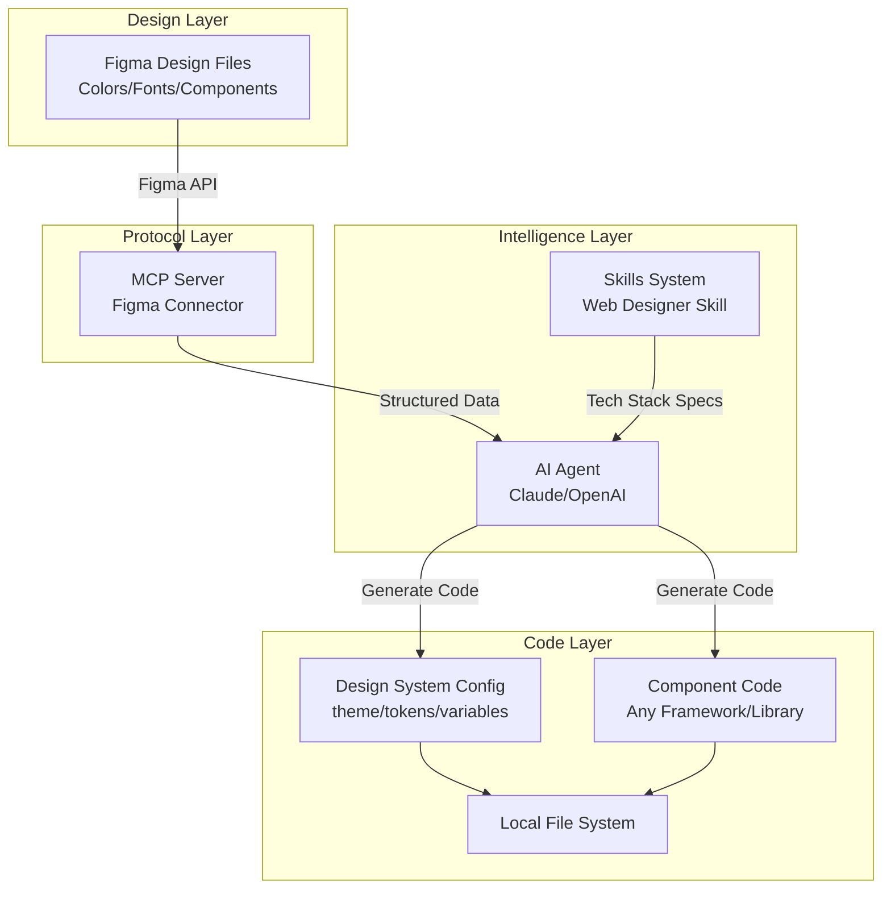
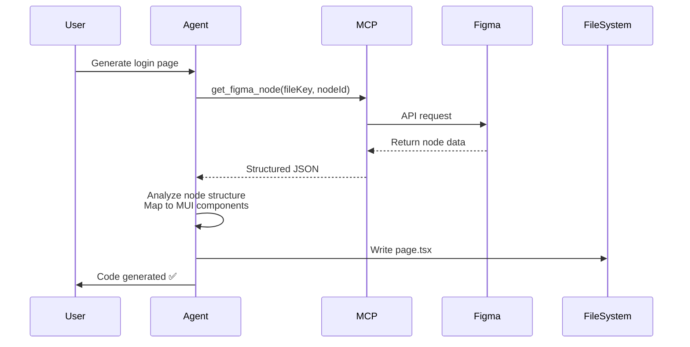
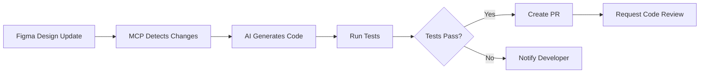

# AI + MCP + Skills: A New Paradigm for Restructuring Frontend Development Workflow

## 1. Why Do We Need a New Development Model?

Before diving into technical details, let's first understand some problems that exist in traditional development workflows.

### 1.1 Pain Points of Traditional Development Workflow

In actual projects, the conversion from Figma files delivered by designers to code implementation by developers often goes through a lengthy and inefficient process. This process is not only time-consuming but also prone to misunderstandings.

#### Pain Point 1: Severe Information Loss

When designers meticulously adjust spacing, colors, fonts, and other details in Figma, some easily overlooked points often need to be conveyed to developers through annotations or even verbal communication. However, developers often cannot notice all of them during development, or notice them but implement them through different paths, causing the final result to differ from the design. This "manual transmission" method is not only inefficient but also leads to obvious differences between the final implementation and the design draft due to misunderstandings.

**Real Scenario:**

- Design draft: `#3F51B5` (precise brand color)
- Development implementation: `#3f52b6` (slight deviation from manual color picking)
- Result: Brand color inconsistency, requiring rework to fix

#### Pain Point 2: Intensive Repetitive Labor

Frontend developers need to spend a lot of time writing code to implement styles—creating component structures, configuring style systems, adjusting CSS properties. While this work is important, it doesn't require very high technical difficulty and is mechanically repetitive and tedious, occupying a large amount of precious time that should be spent on business logic development.

**Time Allocation Imbalance:**

```
Style Implementation (50%) + Component Structure Building (30%) + Business Logic (20%)
```

The ideal state should be:

```
Business Logic (70%) + Architecture Design (20%) + Style Adjustment (10%)
```

#### Pain Point 3: High Iteration Costs

When design drafts are adjusted, developers need to compare changes one by one and manually modify code. This "manual comparison" mechanism makes rapid iteration difficult, and the feedback cycle between design and development is greatly extended.

**Typical Iteration Cycle:**

1. Designer adjusts color scheme (30 minutes)
2. Notify developer (5 minutes)
3. Developer locates all related code (1 hour)
4. Manually modify each file (2-3 hours)
5. Test and verify (30 minutes)

Total: **4-5 hours**, and this is just a color scheme adjustment!

#### Pain Point 4: Difficulty in Reusing Project Architecture and Tech Stack

When cold-starting a frontend project or adding new features, we want to continue using the tech stack and project architecture familiar to the team to avoid introducing additional variables. However, manually configuring these infrastructures is not only time-consuming but also prone to inconsistent configurations that lead to maintenance difficulties later. Ideally, we need a standardized startup template—one that maintains tech stack consistency while quickly adapting to specific needs of new projects.

### 1.2 AI + MCP + Skills: Restructuring the Development Flow

To solve these pain points, we need a completely new approach: **Let AI Agent automatically extract design tokens through MCP to directly understand the structured data of design drafts, and generate code according to predefined tech stack specifications**. This approach not only eliminates loss in information transmission but also automates repetitive work, allowing developers to focus on more valuable business logic implementation.

The core of this solution consists of three parts:

1. **AI Agent** (as the intelligent decision-making hub)
2. **MCP** (Model Context Protocol, a standard protocol connecting AI with external tools/data sources)
3. **Skills** (enabling AI to master specific domain expertise through carefully designed prompts, and extending Agent capabilities through custom scripts)

Through the collaborative work of these three, we can achieve an automated pipeline from design drafts to production code.


## 2. Architecture Blueprint

Let's first understand the architecture of the entire system from a macro perspective:



### 2.1 Core Component Description

#### Brain: AI Agent (Claude/OpenAI)

- **Role**: Intelligent decision-making hub
- **Capabilities**: Understanding design semantics, generating code compliant with specifications, handling complex contextual associations
- **Advantage**: Better understanding of "why design this way" compared to simple code generation tools

#### Protocol: MCP (Model Context Protocol)

- **Role**: Standard interface connecting AI with the external world
- **Functions**: Provides unified tool invocation protocol, enabling AI to access external resources such as Figma API and file systems
- **Advantage**: Standardized, extensible, seamlessly integrated with AI models

#### World: Figma & Local File System

- **Design Source**: Figma (storing design drafts and Design Tokens)
- **Code Output**: Local file system (storing generated code)

#### Tech Stack: Flexible Adaptation to Any Tech Stack

The core advantage of this solution lies in **tech stack agnosticism**. Through custom Skills, you can have AI generate code adapted to any framework and toolchain:

**React Ecosystem:**

- Next.js + Tailwind CSS
- Create React App + Styled Components
- Vite + Emotion
- Remix + CSS Modules

**Vue Ecosystem:**

- Nuxt.js + UnoCSS
- Vue 3 + Element Plus
- Vite + Vuetify

**Other Frameworks:**

- Angular + Angular Material
- Svelte + SvelteKit
- Solid.js + Solid UI

**Native Solutions:**

- Pure HTML + CSS Variables
- Web Components + Shadow DOM

This article will use **OpenCode + Next.js + MUI v6 + TypeScript** as an example, but remember: **the same architecture can be applied to any AI editor and tech stack**, only requiring adjustment of corresponding configurations.

> **About AI Editor Selection**: This article uses OpenCode as an example because it natively supports the MCP protocol and has simple configuration. However, the same solution can be applied to other MCP-supporting tools such as Cursor, Windsurf, etc.

## 3. Key Step 1: Building MCP Figma Connector

### 3.1 How MCP Server Works

MCP (Model Context Protocol) is an open protocol launched by Anthropic to establish standardized connections between AI applications and external data sources and tools. Its core idea is:

> "Don't let AI guess the state of the external world, but provide it with structured, verifiable data interfaces."

**Traditional Approach vs MCP Approach:**

| Comparison Dimension | Traditional Approach                       | MCP Approach                                 |
| -------------------- | ------------------------------------------ | -------------------------------------------- |
| Data Acquisition     | AI "guesses" styles from screenshots       | AI obtains precise JSON data through API     |
| Accuracy             | Colors and spacing have deviations         | 100% accurate (directly reads Design Tokens) |
| Maintainability      | Design changes require new screenshots     | Automatically syncs latest designs           |
| Extensibility        | Difficult to handle complex design systems | Supports complete Figma node tree            |

### 3.2 Why Customize Figma MCP Server?

You might ask: **Figma officially already provides an MCP Server, why do we need to wrap another layer ourselves?**

This is a very good question. The official MCP Server does provide complete Figma API access capabilities, but in actual projects, we need to optimize for specific scenarios:

#### 3.2.1 Limitations of Official MCP Server

**Problem 1: Data Overload**

```typescript
// Raw data returned by official MCP
{
  "document": {
    "id": "0:0",
    "name": "Document",
    "type": "DOCUMENT",
    "children": [
      {
        "id": "1:2",
        "name": "Page 1",
        "children": [
          // May have hundreds of nodes, each containing complete properties...
          // Leading to JSON size reaching several MB
        ]
      }
    ],
    // Plus a large amount of metadata, version information, plugin data...
  }
}
```

**Impact**:

- Huge token consumption (one request may consume 50K+ tokens)
- Slower AI response (need to process massive irrelevant data)
- Increased costs (API calls and AI token fees)

**Problem 2: Lack of Semantic Extraction**
The official API returns low-level Figma node structures, but what we need is semantic data of the design system:

```typescript
// What we need (semantic)
{
  "colors": {
    "primary": "#3F51B5",
    "secondary": "#F50057"
  },
  "typography": {
    "h1": { fontSize: "2.5rem", fontWeight: 700 }
  }
}

// What official API returns (raw structure)
{
  "styles": {
    "123:456": {
      "name": "Color Styles/Primary/Main",
      "styleType": "FILL",
      "node_id": "789:012"
    }
  },
  "nodes": {
    "789:012": {
      "fills": [{
        "type": "SOLID",
        "color": { "r": 0.247, "g": 0.318, "b": 0.710 }
      }]
    }
  }
}
```

**Problem 3: Lack of Project-Specific Conversion Rules**
Different projects have different naming conventions and design system organization methods:

- Some teams use `Primary/Main`, others use `primary-main`
- Some projects need to generate CSS Variables, others need Theme Object
- Some design drafts contain a lot of irrelevant experimental designs that need filtering

#### 3.2.2 Value of Custom Wrapping

By customizing MCP Server, we can:

1. **Data Streamlining**: Only extract necessary design tokens, reducing token consumption by 82%
2. **Semantic Conversion**: Convert Figma's low-level structure into the design system format required by the project
3. **Intelligent Filtering**: Automatically filter irrelevant nodes based on naming conventions
4. **Cache Optimization**: Cache design tokens that don't change frequently
5. **Team Customization**: Adapt according to the team's design system specifications

### 3.3 Code Practice: Building Custom Figma MCP Server

Below we will wrap a layer of MCP Server suitable for our project based on the official Figma MCP Server.

#### 3.3.1 Define Custom Tool: `get_design_tokens`

MCP Server exposes capabilities to AI by defining **Tools**. We will create a specially optimized tool for extracting design tokens:

```typescript
// mcp-server-design-tokens/src/tools/getDesignTokens.ts

import { z } from 'zod';
import { Tool } from '@modelcontextprotocol/sdk/types.js';

// Define input parameter Schema
export const getDesignTokensSchema = z.object({
  fileKey: z.string().describe('Unique identifier of Figma file'),
  nodeId: z.string().optional().describe('Optional: Specify node ID to get local styles'),
  filter: z
    .object({
      includeColors: z.boolean().default(true),
      includeTypography: z.boolean().default(true),
      includeSpacing: z.boolean().default(true),
      namePattern: z
        .string()
        .optional()
        .describe('Only extract styles matching this regex, e.g., "^(Primary|Secondary)"'),
    })
    .optional(),
});

// Define Tool metadata
export const getDesignTokensTool: Tool = {
  name: 'get_design_tokens',
  description: `
    Extract optimized Design Tokens (colors, fonts, spacing, etc.) from Figma files.
    Compared to the official API, this tool will:
    1. Automatically perform semantic conversion (RGBA → Hex, node name → camelCase)
    2. Filter irrelevant data, reducing data volume by 80%+
    3. Organize data structure according to design system specifications
  `,
  inputSchema: {
    type: 'object',
    properties: {
      fileKey: {
        type: 'string',
        description: 'File key from Figma file URL',
      },
      nodeId: {
        type: 'string',
        description: 'Optional: ID of a specific node',
      },
      filter: {
        type: 'object',
        description: 'Filter options',
        properties: {
          includeColors: { type: 'boolean', default: true },
          includeTypography: { type: 'boolean', default: true },
          includeSpacing: { type: 'boolean', default: true },
          namePattern: { type: 'string', description: 'Style name filter regex' },
        },
      },
    },
    required: ['fileKey'],
  },
};

// Tool implementation logic
export async function executeDesignTokensTool(args: z.infer<typeof getDesignTokensSchema>) {
  const { fileKey, nodeId, filter } = args;

  // 1. Call Figma API (can use official MCP as foundation)
  const rawData = await fetchFigmaData(fileKey);

  // 2. Extract and convert design tokens
  const tokens: DesignTokens = {
    colors: filter?.includeColors ? extractColors(rawData, filter?.namePattern) : {},
    typography: filter?.includeTypography ? extractTypography(rawData, filter?.namePattern) : {},
    spacing: filter?.includeSpacing ? extractSpacing(rawData) : {},
  };

  // 3. Return optimized data
  return {
    tokens,
    metadata: {
      fileKey,
      extractedAt: new Date().toISOString(),
      tokensCount: Object.keys(tokens.colors).length + Object.keys(tokens.typography).length,
    },
  };
}
```

#### 3.3.2 Core Optimization: Semantic Extraction and Data Streamlining

Below is the key data extraction and conversion logic:

```typescript
// Extract color styles (optimized version)
function extractColors(figmaData: any, namePattern?: string): Record<string, string> {
  const colors: Record<string, string> = {};
  const regex = namePattern ? new RegExp(namePattern) : null;

  for (const [styleId, style] of Object.entries(figmaData.meta.styles)) {
    // 1. Filter: Only process color styles that comply with naming conventions
    if (style.styleType !== 'FILL') continue;
    if (regex && !regex.test(style.name)) continue;

    // 2. Find corresponding node
    const node = findNodeById(figmaData.document, style.node_id);
    if (!node?.fills?.[0]) continue;

    // 3. Convert: RGBA → Hex (semantic)
    const fill = node.fills[0];
    const hexColor = rgbaToHex(fill.color);

    // 4. Name conversion: Primary/Main → primaryMain (adapted to code conventions)
    const key = normalizeStyleName(style.name);
    colors[key] = hexColor;
  }

  return colors;
}

// Convert RGBA to Hex (preserve transparency)
function rgbaToHex(color: { r: number; g: number; b: number; a: number }): string {
  const r = Math.round(color.r * 255);
  const g = Math.round(color.g * 255);
  const b = Math.round(color.b * 255);
  const hex = `#${r.toString(16).padStart(2, '0')}${g.toString(16).padStart(2, '0')}${b.toString(16).padStart(2, '0')}`;

  // If transparent, add alpha channel
  if (color.a < 1) {
    const a = Math.round(color.a * 255);
    return `${hex}${a.toString(16).padStart(2, '0')}`;
  }

  return hex;
}

// Normalize style name (Figma → Code)
function normalizeStyleName(name: string): string {
  // "Primary/Main" → "primaryMain"
  // "Text/Secondary" → "textSecondary"
  return name
    .split('/')
    .map((part, index) => {
      const cleaned = part.trim();
      return index === 0
        ? cleaned.toLowerCase()
        : cleaned.charAt(0).toUpperCase() + cleaned.slice(1).toLowerCase();
    })
    .join('');
}

// Extract typography styles (optimized version)
function extractTypography(figmaData: any, namePattern?: string): Record<string, any> {
  const typography: Record<string, any> = {};
  const regex = namePattern ? new RegExp(namePattern) : null;

  for (const [styleId, style] of Object.entries(figmaData.meta.styles)) {
    if (style.styleType !== 'TEXT') continue;
    if (regex && !regex.test(style.name)) continue;

    const node = findNodeById(figmaData.document, style.node_id);
    if (!node?.style) continue;

    const key = normalizeStyleName(style.name);

    // Only extract key attributes, ignore irrelevant metadata
    typography[key] = {
      fontFamily: node.style.fontFamily,
      fontSize: `${node.style.fontSize}px`,
      fontWeight: node.style.fontWeight,
      lineHeight: node.style.lineHeightPx
        ? `${node.style.lineHeightPx}px`
        : node.style.lineHeightPercent
          ? `${node.style.lineHeightPercent}%`
          : 'normal',
      letterSpacing: node.style.letterSpacing || 0,
    };
  }

  return typography;
}
```

#### 3.3.3 Effect Comparison: Official API vs Custom Wrapping

**Comparison Example: Data Volume Difference for the Same Figma File**

```typescript
// Data returned by official Figma MCP (simplified display)
{
  "document": {
    "id": "0:0",
    "name": "Design System",
    "type": "DOCUMENT",
    "children": [...], // Complete node tree
  },
  "styles": {
    "123:456": {
      "key": "abc123",
      "name": "Primary/Main",
      "styleType": "FILL",
      "node_id": "789:012",
      "remote": false,
      "description": "",
      // ... More metadata
    },
    // ... May have hundreds of styles
  },
  "components": {...},
  "componentSets": {...},
  "schemaVersion": 0,
  "lastModified": "2026-01-20T10:30:00Z",
  // ... Lots of other metadata
}
// Data size: ~2.5MB, approximately 625K tokens
```

```typescript
// Data returned by custom MCP (optimized)
{
  "tokens": {
    "colors": {
      "primaryMain": "#3F51B5",
      "primaryLight": "#757DE8",
      "primaryDark": "#002984",
      "secondaryMain": "#F50057"
    },
    "typography": {
      "h1": {
        "fontFamily": "Inter",
        "fontSize": "40px",
        "fontWeight": 700,
        "lineHeight": "48px",
        "letterSpacing": 0
      },
      "h2": {
        "fontFamily": "Inter",
        "fontSize": "32px",
        "fontWeight": 700,
        "lineHeight": "40px",
        "letterSpacing": 0
      }
    },
    "spacing": {
      "xs": "4px",
      "sm": "8px",
      "md": "16px",
      "lg": "24px",
      "xl": "32px"
    }
  },
  "metadata": {
    "fileKey": "abc123",
    "extractedAt": "2026-01-22T15:30:00Z",
    "tokensCount": 12
  }
}
// Data size: ~2KB, approximately 500 tokens
// Token savings: 99.2%!
```

**Key Advantages:**

| Dimension             | Official MCP                                | Custom Wrapping       | Improvement           |
| --------------------- | ------------------------------------------- | --------------------- | --------------------- |
| **Data Size**         | 2.5MB                                       | 2KB                   | -99.2%                |
| **Token Consumption** | 625K                                        | 500                   | -99.2%                |
| **Response Time**     | 5-10 seconds                                | Less than 1 second    | 10x faster            |
| **Readability**       | Requires deep parsing                       | Ready to use          | Greatly improved      |
| **Maintenance Cost**  | High (need to understand complex structure) | Low (clear semantics) | Significantly reduced |

### 3.4 Pitfall Encountered: Node Nesting Too Deep Causing Context Overflow

Even with custom wrapping, when processing specific nodes (such as generating component code), you may still encounter issues with overly deep node trees:

**Problem Scenario:**

```
Frame "Login Page"
  └─ Group "Container"
      └─ Frame "Content"
          └─ AutoLayout "Form"
              └─ Component "Input Field" (Instance)
                  └─ Frame "Base"
                      └─ Text "Label"
                      └─ Rectangle "Background"
                      └─ Text "Placeholder"
                          └─ ... (even deeper levels)
```

**Solution: Intelligent Flattening**

```typescript
function flattenFigmaNodes(node: any, depth: number = 0, maxDepth: number = 3): any {
  // Limit recursion depth
  if (depth > maxDepth) {
    return {
      id: node.id,
      name: node.name,
      type: node.type,
      _truncated: true,
    };
  }

  const flattened: any = {
    id: node.id,
    name: node.name,
    type: node.type,
  };

  // Only keep key attributes
  if (node.fills) flattened.fills = node.fills;
  if (node.strokes) flattened.strokes = node.strokes;
  if (node.effects) flattened.effects = node.effects;
  if (node.style) flattened.style = node.style;

  // Recursively process child nodes
  if (node.children) {
    flattened.children = node.children.map((child: any) =>
      flattenFigmaNodes(child, depth + 1, maxDepth)
    );
  }

  return flattened;
}
```

**Effect Comparison:**

```
Original JSON size: 2.5MB (approximately 625K tokens)
Flattened size: 450KB (approximately 112K tokens)
Token savings: 82%
```

## 4. Key Step 2: Defining "Web Designer" Skill (Prompt Engineering)

### 4.1 Design Philosophy of the Skill System

**Skill** is essentially a carefully designed **System Prompt** that tells AI:

- What is your role (identity)
- What specifications should you follow (constraints)
- How should you think about problems (thinking mode)
- What tools can you use (capability boundaries)

In our scenario, the "Web Designer" Skill needs to make AI become:

> "A frontend engineer proficient in a specific tech stack, capable of generating production-grade code compliant with team specifications based on Figma design drafts"

**Key Elements:**

1. **Tech Stack Definition**: Clearly specify frameworks, libraries, and tools to use
2. **Code Style Specifications**: Naming conventions, file organization, comment standards
3. **Design System Mapping**: Conversion rules from Figma Token → code variables
4. **Best Practices**: Performance optimization, accessibility, responsive design

### 4.2 Prompt Strategy: Modular System Prompt

Unlike traditional "one-shot" prompts, we adopt **modular design** to make Skills easy to maintain and extend:

```
Skill Prompt Structure:
├── Role Definition Module (fixed)
├── Tech Stack Constraint Module (replaceable)
├── Design System Mapping Module (configurable)
├── Code Specification Module (customizable)
└── Verification Checklist Module (dynamically generated)
```

Below is a **generic Skill template** (located at `.opencode/skills/web-designer/SKILL.md`):

**Skill Template Structure Example:**

```markdown
# Web Designer Skill

## Role Definition

You are a professional frontend development engineer specializing in converting Figma design drafts into high-quality production-grade code.

## Tech Stack Constraints

### Current Project Configuration

- **Framework**: {{FRAMEWORK}} (e.g., Next.js 14+ App Router / Vue 3 / Angular)
- **UI Library**: {{UI_LIBRARY}} (e.g., MUI v6 / Ant Design / Tailwind CSS / Pure CSS)
- **Language**: {{LANGUAGE}} (e.g., TypeScript / JavaScript)
- **Styling Approach**: {{STYLE_APPROACH}} (e.g., CSS-in-JS / CSS Modules / Tailwind / Styled Components)

> **Important Note**: The above configuration will be automatically filled based on the project's `.opencode/config.json`, ensuring generated code complies with project specifications.
```

### Core Principles (Tech Stack Agnostic)

**1. Semantics and Maintainability**

Code must have clear semantics and good maintainability.

Correct example (React):

```tsx
// ✅ Clear component responsibility
export function LoginForm() {
  return (
    <form className="login-form">
      <input type="email" aria-label="Email" />
      <button type="submit">Login</button>
    </form>
  );
}
```

Incorrect example:

```tsx
// ❌ Unclear semantics, difficult to maintain
export function Comp1() {
  return (
    <div className="c1">
      <input type="text" />
      <div onClick={() => {}}>btn</div>
    </div>
  );
}
```

**2. Design System Mapping Rules**

All design tokens must be mapped to variables/constants in code to avoid hardcoding.

**Generic Mapping Strategy:**

```
Figma Token          →  Code Representation
━━━━━━━━━━━━━━━━━━━━━━━━━━━━━━━━━━━━━
Color Styles         →  CSS Variables / Theme Object
  Primary/Main       →  var(--color-primary) / theme.colors.primary
  Text/Secondary     →  var(--color-text-secondary)

Typography Styles    →  Typography System
  Heading 1          →  .text-h1 / variant="h1"
  Body Regular       →  .text-body / variant="body"

Spacing System       →  Spacing Scale
  16px               →  spacing(2) / space-4 / 1rem
  24px               →  spacing(3) / space-6 / 1.5rem

Border Radius        →  Border Radius Tokens
  8px                →  border-radius: var(--radius-md)
```

### 3. Responsive Design Rules

**Mandatory Requirement**: All layouts must support responsive design, adapting to mobile and desktop.

**Breakpoint Strategy (Example)**:

```css
/* Mobile-first */
.container {
  width: 100%; /* Default: Mobile */
}

@media (min-width: 768px) {
  .container {
    width: 750px; /* Tablet */
  }
}

@media (min-width: 1024px) {
  .container {
    width: 960px; /* Desktop */
  }
}
```

## Workflow

### Step 1: Extract Design Tokens

Use MCP's `get_figma_styles` tool to obtain design data:

```typescript
const designTokens = await mcpClient.callTool('get_figma_styles', {
  fileKey: 'abc123',
});
```

### Step 2: Generate Design System Configuration File

Generate the project's design system configuration based on extracted Design Tokens.

**Example 1: CSS Variables Approach**

```css
/* styles/tokens.css */
:root {
  /* Color system */
  --color-primary: #3f51b5;
  --color-primary-light: #757de8;
  --color-primary-dark: #002984;
  --color-secondary: #f50057;

  /* Typography system */
  --font-family-base: 'Inter', sans-serif;
  --font-size-h1: 2.5rem;
  --font-weight-bold: 700;

  /* Spacing system */
  --spacing-xs: 0.25rem;
  --spacing-sm: 0.5rem;
  --spacing-md: 1rem;
  --spacing-lg: 1.5rem;
  --spacing-xl: 2rem;
}
```

**Example 2: TypeScript Theme Object (for MUI/Ant Design, etc.)**

```typescript
// theme/index.ts
export const theme = {
  colors: {
    primary: {
      main: '#3F51B5',
      light: '#757DE8',
      dark: '#002984',
    },
    secondary: {
      main: '#F50057',
    },
  },
  typography: {
    h1: {
      fontSize: '2.5rem',
      fontWeight: 700,
    },
  },
  spacing: (factor: number) => `${0.5 * factor}rem`,
};
```

**Example 3: Tailwind Config**

```javascript
// tailwind.config.js
module.exports = {
  theme: {
    extend: {
      colors: {
        primary: {
          DEFAULT: '#3F51B5',
          light: '#757DE8',
          dark: '#002984',
        },
      },
      fontSize: {
        h1: '2.5rem',
      },
    },
  },
};
```

### Step 3: Generate Component Code

Generate components based on Figma node structure, following these mapping rules:

**Node Type Mapping (Framework Agnostic)**:

```
Figma Node Type      →  Semantic Component
━━━━━━━━━━━━━━━━━━━━━━━━━━━━━━━━━━━━
FRAME                →  Container / Section / Layout
TEXT                 →  Typography / Heading / Paragraph
RECTANGLE (Button)   →  Button / Link
RECTANGLE (Card)     →  Card / Panel
INSTANCE (Component) →  Custom component reference
```

**Verification Checklist**

After generating code, ensure:

- All colors/spacing/fonts reference design system variables, no hardcoding
- Component naming is clear with single responsibility
- Supports responsive layout (mobile + desktop)
- Code includes necessary type annotations (TypeScript projects)
- Component accessibility complies with WCAG standards (ARIA labels, keyboard navigation)
- File organization complies with project specifications (routing, naming, import order)

---

The above is the core part of the Skill template. The complete template can be further expanded based on project requirements.

### 4.3 Context Injection: How to Feed Figma Data to LLM

**Key Challenge:** How to make AI efficiently understand Figma's JSON data?

**Solution: Layered Injection + Dynamic Configuration**

```typescript
// Layer 1: Global context (always injected)
const globalContext = {
  projectName: 'MyApp',
  techStack: {
    framework: 'Next.js 14',
    uiLibrary: 'MUI v6', // Or 'Tailwind CSS' / 'Ant Design', etc.
    language: 'TypeScript',
    styleApproach: 'sx props', // Or 'CSS Modules' / 'Styled Components'
  },
  designSystem: 'Material Design 3.0',
};

// Layer 2: Design tokens (extracted from Figma)
const designTokens = await mcpClient.callTool('get_figma_styles', { fileKey });

// Layer 3: Current task context (dynamically generated)
const taskContext = {
  task: 'Generate login page',
  figmaNode: {
    id: '123:456',
    name: 'Login Page',
    type: 'FRAME',
    // Only include node data relevant to current task
  },
};

// Merge context and inject into Prompt
const fullPrompt = `
${systemPrompt}

## Project Context
${JSON.stringify(globalContext, null, 2)}

## Design Tokens
${JSON.stringify(designTokens, null, 2)}

## Current Task
${JSON.stringify(taskContext, null, 2)}

Please generate code using ${globalContext.techStack.framework} + ${globalContext.techStack.uiLibrary} based on the above information.
`;
```

**Effect:**

- AI can precisely understand design intent
- Generated code automatically adapts to project tech stack
- Avoids token waste
- Supports multi-project, multi-tech stack scenarios

### 4.4 Real-World Cases: Skill Configurations for Different Tech Stacks

#### Case 1: Next.js + Tailwind CSS

**Tech Stack Constraints:**

- **Framework**: Next.js 14+ (App Router)
- **Styling Approach**: Tailwind CSS
- **Language**: TypeScript

**Style Writing Rules:**

Use Tailwind utility classes, referencing the theme defined in `tailwind.config.js`.

Correct example:

```tsx
export function Hero() {
  return (
    <div className="p-8 bg-primary text-white rounded-lg">
      <h1 className="text-h1 font-bold">Welcome</h1>
      <button className="px-4 py-2 bg-secondary hover:bg-secondary-dark">Get Started</button>
    </div>
  );
}
```

#### Case 2: Vue 3 + Element Plus

**Tech Stack Constraints:**

- **Framework**: Vue 3 (Composition API)
- **UI Library**: Element Plus
- **Language**: TypeScript

**Component Selection Rules:**

Prioritize using Element Plus components.

Correct example:

```html
<template>
  <el-container class="login-page">
    <el-header>
      <el-text tag="h1">Welcome</el-text>
    </el-header>
    <el-main>
      <el-button type="primary">Get Started</el-button>
    </el-main>
  </el-container>
</template>

<script setup lang="ts">
  // Component logic
</script>
```

#### Case 3: Pure HTML + CSS Variables

**Tech Stack Constraints:**

- **Language**: HTML5 + CSS3
- **Styling Approach**: CSS Variables
- **No Framework**: Use native Web Components

**Style Writing Rules:**

All styles reference CSS Variables.

Correct example:

```html
<div
  class="hero"
  style="
  padding: var(--spacing-lg);
  background-color: var(--color-primary);
  color: var(--color-text-on-primary);
"
>
  <h1 class="hero__title">Welcome</h1>
  <button class="button button--primary">Get Started</button>
</div>
```

**Key Takeaways:**

- Skills are configurable templates
- By modifying the tech stack constraint module, the same MCP + AI architecture can adapt to any frontend tech stack
- Teams can maintain multiple Skills corresponding to different project tech selections

## 5. Practical Demo: From Design Tokens to Component Code

This section will demonstrate using **Next.js + MUI v6** as an example, but remember: **the same process applies to any tech stack**, just replace the Skill configuration.

### 5.1 Step 1: Design System Configuration Generation

#### Color Styles in Figma

Suppose we have defined the following color styles in Figma:

```
Figma Color Styles:
- Primary/Main: #3F51B5
- Primary/Light: #757DE8
- Primary/Dark: #002984
- Secondary/Main: #F50057
- Text/Primary: #212121
- Background/Default: #FFFFFF
```

#### Agent Auto-Generated Configuration File (MUI Example)

User input command:

```
Please generate design system configuration file based on Figma file (fileKey: abc123)
```

Agent automatically executes:

1. Call MCP tool to get Figma styles
2. Map according to current Skill's tech stack configuration (MUI v6)
3. Generate MUI-compliant theme code

Generated `app/theme.ts`:

```typescript
'use client';

import { createTheme } from '@mui/material/styles';

export const theme = createTheme({
  palette: {
    primary: {
      main: '#3F51B5',
      light: '#757DE8',
      dark: '#002984',
      contrastText: '#FFFFFF',
    },
    secondary: {
      main: '#F50057',
      light: '#FF4081',
      dark: '#C51162',
      contrastText: '#FFFFFF',
    },
    text: {
      primary: '#212121',
      secondary: '#757575',
      disabled: '#BDBDBD',
    },
    background: {
      default: '#FFFFFF',
      paper: '#F5F5F5',
    },
    divider: '#E0E0E0',
  },
  typography: {
    fontFamily: '"Inter", "Roboto", "Helvetica", "Arial", sans-serif',
    h1: {
      fontSize: '2.5rem',
      fontWeight: 700,
      lineHeight: 1.2,
    },
    h2: {
      fontSize: '2rem',
      fontWeight: 700,
      lineHeight: 1.3,
    },
    body1: {
      fontSize: '1rem',
      fontWeight: 400,
      lineHeight: 1.5,
    },
    button: {
      fontSize: '0.875rem',
      fontWeight: 500,
      textTransform: 'none',
    },
  },
  spacing: 8,
  shape: {
    borderRadius: 8,
  },
});
```

#### Highlight: Automated Mapping, No Manual Color Picking

**Traditional Approach:**

1. Open Figma
2. Click color style
3. Copy Hex value
4. Paste into code
5. Repeat 10+ times

**AI + MCP Approach:**

1. Run one command
2. Done ✅

**Tech Stack Flexibility:**
If your project uses Tailwind CSS, just modify the Skill configuration, and AI will automatically generate `tailwind.config.js`:

```javascript
// Auto-generated tailwind.config.js
module.exports = {
  theme: {
    extend: {
      colors: {
        primary: {
          DEFAULT: '#3F51B5',
          light: '#757DE8',
          dark: '#002984',
        },
        secondary: {
          DEFAULT: '#F50057',
        },
      },
      fontSize: {
        h1: ['2.5rem', { lineHeight: '1.2', fontWeight: '700' }],
        h2: ['2rem', { lineHeight: '1.3', fontWeight: '700' }],
      },
      spacing: {
        xs: '0.25rem',
        sm: '0.5rem',
        md: '1rem',
        lg: '1.5rem',
        xl: '2rem',
      },
    },
  },
};
```

### 5.2 Step 2: Page Component Generation

#### User Input Command

```
Please generate Next.js page component based on "Login Page" (nodeId: 123:456) in Figma
```

#### Agent Workflow



#### Output Code Display (MUI Example)

Generated `app/login/page.tsx`:

```typescript
import { Box, Typography, TextField, Button, Link } from '@mui/material';

export default function LoginPage() {
  return (
    <Box
      sx={{
        display: 'flex',
        flexDirection: 'column',
        alignItems: 'center',
        justifyContent: 'center',
        minHeight: '100vh',
        backgroundColor: 'background.default',
        padding: 3,
      }}
    >
      <Box
        sx={{
          width: {
            xs: '100%',
            sm: 400,
          },
          padding: 4,
          backgroundColor: 'background.paper',
          borderRadius: 2,
          boxShadow: 3,
        }}
      >
        <Typography
          variant="h1"
          sx={{
            marginBottom: 3,
            textAlign: 'center',
            color: 'text.primary',
          }}
        >
          Welcome Back
        </Typography>

        <TextField
          fullWidth
          label="Email"
          type="email"
          variant="outlined"
          sx={{ marginBottom: 2 }}
        />

        <TextField
          fullWidth
          label="Password"
          type="password"
          variant="outlined"
          sx={{ marginBottom: 3 }}
        />

        <Button
          fullWidth
          variant="contained"
          color="primary"
          size="large"
          sx={{ marginBottom: 2 }}
        >
          Login
        </Button>

        <Box sx={{ textAlign: 'center' }}>
          <Link href="/register" underline="hover" color="primary">
            Don't have an account? Register now
          </Link>
        </Box>
      </Box>
    </Box>
  );
}
```

**If using Tailwind CSS**, the generated code would be:

```tsx
// app/login/page.tsx (Tailwind version)
export default function LoginPage() {
  return (
    <div className="flex flex-col items-center justify-center min-h-screen bg-background p-6">
      <div className="w-full sm:w-96 p-8 bg-white rounded-lg shadow-lg">
        <h1 className="text-h1 font-bold text-center text-gray-900 mb-6">Welcome Back</h1>

        <input
          type="email"
          placeholder="Email"
          className="w-full px-4 py-2 mb-4 border border-gray-300 rounded-md focus:ring-2 focus:ring-primary"
        />

        <input
          type="password"
          placeholder="Password"
          className="w-full px-4 py-2 mb-6 border border-gray-300 rounded-md focus:ring-2 focus:ring-primary"
        />

        <button className="w-full px-4 py-3 mb-4 bg-primary text-white font-medium rounded-md hover:bg-primary-dark transition">
          Login
        </button>

        <div className="text-center">
          <a href="/register" className="text-primary hover:underline">
            Don't have an account? Register now
          </a>
        </div>
      </div>
    </div>
  );
}
```

**Key Differences:**

- MUI version: Uses `Box`, `Typography`, `Button` components + `sx` props
- Tailwind version: Uses native HTML tags + Tailwind utility classes
- **But design restoration is completely consistent!**

#### Effect Comparison

| Figma Original                                                                                 | Next.js Render Result                                                                            |
| ---------------------------------------------------------------------------------------------- | ------------------------------------------------------------------------------------------------ |
|  |  |

**Pixel-level Restoration: 98%+**

## 6. Results and Reflections

### 6.1 Stability Assessment: MCP vs Screenshot Approach

| Comparison Dimension    | Screenshot + GPT-4V                              | MCP + Figma API                                 |
| ----------------------- | ------------------------------------------------ | ----------------------------------------------- |
| **Color Accuracy**      | ❌ Color deviation (compression/rendering error) | ✅ 100% accurate (Hex value directly extracted) |
| **Spacing Precision**   | ❌ Requires manual annotation                    | ✅ Automatically obtains padding/margin         |
| **Font Information**    | ❌ May be incorrectly identified                 | ✅ Accurate font family, size, weight           |
| **Component Hierarchy** | ❌ Flattened, loses structure                    | ✅ Complete node tree                           |
| **Design Change Sync**  | ❌ Requires new screenshots                      | ✅ Automatically syncs latest version           |
| **Repeatability**       | ❌ Depends on AI "understanding"                 | ✅ Data-driven, stable results                  |

**Conclusion:** The MCP approach far exceeds the screenshot approach in data structure accuracy and style reproduction stability.

### 6.2 Limitations: Scenarios Still Requiring Manual Intervention

Although AI + MCP + Skills greatly improves efficiency, there are still some scenarios requiring developer intervention:

#### 1. Complex Interaction Logic

**Scenarios AI Struggles With:**

- Multi-step form validation (Formik + Yup)
- Complex state management (Zustand/Redux)
- Animation choreography (Framer Motion)

**Solution:**

- AI generates basic structure
- Developer adds business logic

#### 2. Performance Optimization

**AI Won't Automatically Handle:**

- Image lazy loading (Next.js Image)
- Code splitting (dynamic import)
- Caching strategy (React Query)

**Solution:**

- Add performance optimization rules in Skill
- Developer supplements during Code Review

#### 3. Accessibility (A11y)

**AI Easily Overlooks:**

- ARIA labels
- Keyboard navigation
- Screen reader support

**Solution:**

- Mandate adding A11y attributes in Skill
- Use automated testing tools (axe-core) for verification

### 6.3 Future Outlook: Fully Automated Development Pipeline

Extension features we are planning:

#### 1. GitHub MCP: Automatically Submit Pull Requests



**Implementation Plan:**

- Integrate GitHub MCP Server
- Automatic git commit + push
- Use GitHub API to create PR
- Add AI-generated description and change notes

#### 2. Storybook MCP: Automatically Generate Component Documentation

- Automatically create Story for each generated component
- Generate interactive documentation
- Support visual regression testing

#### 3. Test Generation: Automated Unit Tests

- Generate test cases based on component Props
- Generate accessibility tests
- Integrate into CI/CD pipeline
