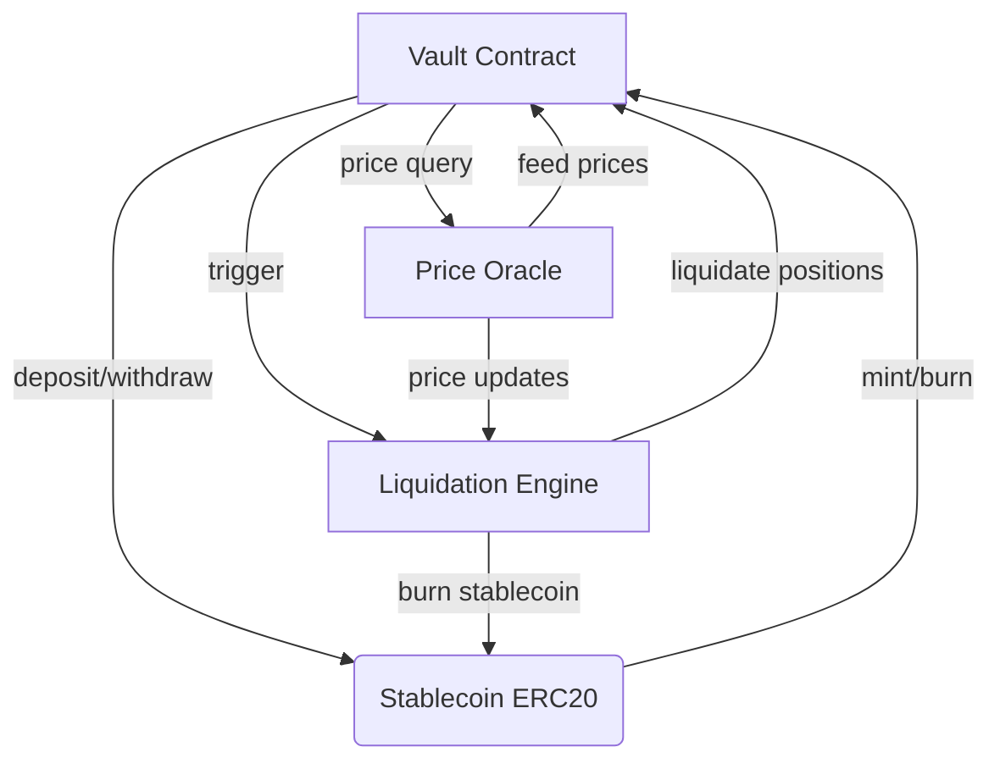
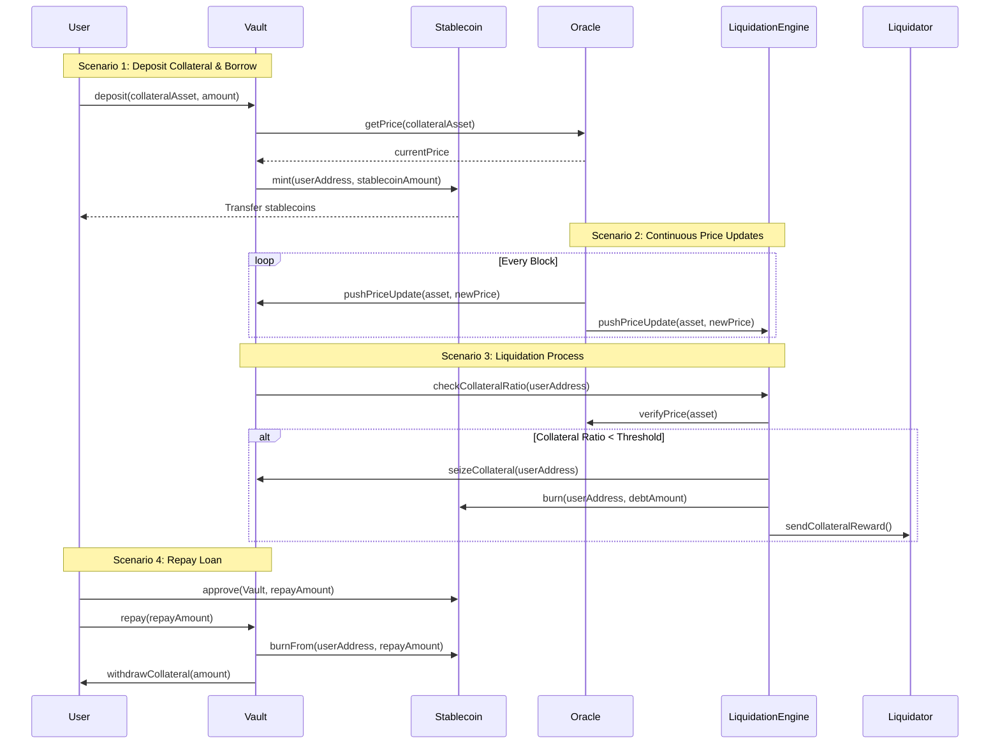

# How To Realize A Simple Collateralized Stablecoin Protocol

## 1. Introduction

Collateralized stablecoins are a fundamental building block of DeFi, providing price stability through overcollateralization. This article will guide you through creating a simple yet robust collateralized stablecoin protocol on Ethereum.

## 2. What is collateralized stablecoin? and why is it stable?

Collateralized stablecoins are a type of stablecoin that are collateralized by a specific asset. The most common collateral asset is USDC, USDT, ETH, etc.
The price of the stablecoin is pegged to the price of the collateral asset, so that the stablecoin is stable. To make it stable, we should design a incentives mechanism to make it most
profitable to keep the price stable.

For example, if we want to make the stablecoin price stable at 1 USD, we should let the borrowable amount of stablecoin is less than the collateral's total price in USD,
. And if the price of the stablecoin is too high and you want to repay the debt to withdraw the collateral, you will not do this,
because you need to pay the premium of stablecoin to repay the debt, that's not profitable, since this kind of requirement is few,
so the price of the stablecoin will less likely to be higher than 1 USD.

Conversely, when the price drops below the peg, the Liquidation mechanism comes into play.
If a user's collateral value falls below a pre - set threshold due to price fluctuations,
their collateral will be able to be liquidated by the liquidation mechanism.
To further enhance the effectiveness of the stability - maintaining mechanism,
we will add a panelty to who are lack of collateral and cause the price drop,
individuals who take the initiative to liquidate their debts can be rewarded with a portion of the penalties
. This not only encourages debtors to act promptly to avoid more serious consequences
but also distributes the burden of maintaining market stability more fairly among participants.

## 2. Prerequisites

### Development Environment Setup

- Node.js and npm installation, this is for installing truffle and developing dapp
- Solidity compiler setup, so that you can compile the solidity code
- Install Truffle development framework which can reduce the difficulty of developing and deploying smart contracts, and also provide a local network for testing
- MetaMask wallet configuration, this is for deploying the contract and interacting with the contract
- Sepolia, an official testnet of Ethereum, is used for testing

## 3. Core Protocol Design

### What should we consider when designing the protocol?

Before we start to implement the protocol, we need to design the architecture of the protocol,
and our goal is to make it more robust, scalable, and secure, and also easy to understand and maintain, and
obviously, to handle the price fluctuation of the collateral to make the stablecoin at a stable price.

To address these questions, we need to design the architecture of the protocol, first of all,
we need to choose which protocol to be used by our stablecoin, here I choose ERC20 as the protocol of the stablecoin, because it is the most common protocol with mature tools and libraries.
And as which coin to be used as the collateral, common collaterals are USDC, USDT, ETH, NFTs, etc., since we want to make it simple and it's on the ethereum network, so I choose ETH as the collateral.
So that we need a vault contract to manage the collateral, and we need to get the price of the collateral, so we also need an orable contract and for the price feed,
I choose ChainLink, because it's widely used and relatively reliable.
And the most important part, there should be a liquidatation mechanism, which can deal the debt when price changes and maintain the token price stable.

The following are the core components of the protocol:

- ERC20 Token Contract
- Vault Contract (collateral management)
- Price Oracle Integration
- Liquidation Mechanism

After we have an rough architecture of it, we should dive deeper into the details of the protocol.
There will be at last 5 methods vault should expose to the outside:

- deposit
- withdraw
- borrow
- repay
- liquidate

And the token contract should provide at least mint and burn, oracle contract should at least provide a method to get the price change.

According above we can get the following diagram shows the architecture of the protocol:



and the following diagram shows the process of collateralization:



For further details, I will introduce with the implementation details of the protocol in the following sections.

## 4. Smart Contract Development

Let's dive into the core implementation of our stablecoin protocol. We'll examine each component in detail:

### 4.1 Stablecoin Token (ZetaCoin)

Our stablecoin is implemented as an ERC20 token with minting and burning controlled by the vault:

```solidity
// SPDX-License-Identifier: MIT
pragma solidity ^0.8.0;

import "@openzeppelin/contracts/token/ERC20/ERC20.sol";
import "@openzeppelin/contracts/access/Ownable.sol";

contract ZetaCoin is ERC20, Ownable {
    constructor() ERC20("ZetaCoin", "ZETA") {}

    function mint(address to, uint256 amount) external onlyOwner {
        _mint(to, amount);
    }

    function burn(address from, uint256 amount) external onlyOwner {
        _burn(from, amount);
    }
}
```

### 4.2 Vault Contract Structure

The vault manages collateral positions and defines key risk parameters:

```solidity
// SPDX-License-Identifier: MIT
pragma solidity ^0.8.0;

contract Vault {
    struct Position {
        uint256 collateral;
        uint256 debt;
        uint256 lastUpdate;
    }

    // Constants
    uint256 public constant MIN_COLLATERAL_RATIO = 150; // 150%
    uint256 public constant LIQUIDATION_RATIO = 130; // 130%
    uint256 public constant LIQUIDATION_PENALTY = 10; // 10%

    // State variables
    mapping(address => Position) public positions;
    uint256 public totalCollateral;
    uint256 public totalDebt;

    // ... rest of the contract
}
```

### 4.3 Core Operations

Users can deposit ETH as collateral and this will increase the total collateral amount:

```solidity
function deposit() external payable {
    require(msg.value > 0, "Must deposit some ETH");
    Position storage position = positions[msg.sender];
    position.collateral += msg.value;
    totalCollateral += msg.value;
    emit Deposit(msg.sender, msg.value);
}
```

And borrow stablecoins against their collateral, this will increase the total debt amount:

```solidity
function borrow(uint256 amount) external {
    Position storage position = positions[msg.sender];
    require(amount > 0, "Must borrow some ZetaCoin");
    require(canBorrow(msg.sender, amount), "Insufficient collateral");

    position.debt += amount;
    totalDebt += amount;
    zetaCoin.mint(msg.sender, amount);
    emit Borrow(msg.sender, amount);
}
```

User can withdraw the collateral as long as the debt is still within collateral ratio:

```solidity
function withdraw(uint256 amount) external {
    Position storage position = positions[msg.sender];
    require(amount > 0, "Must withdraw some ETH");
    require(amount <= position.collateral, "Insufficient collateral");
    require(canWithdraw(msg.sender, amount), "Would violate collateral ratio");

    position.collateral -= amount;
    totalCollateral -= amount;
    payable(msg.sender).transfer(amount);
    emit Withdraw(msg.sender, amount);
}
```

User can also repay the debt, this will decrease the total debt amount:

```solidity
function repay(uint256 amount) external {
    Position storage position = positions[msg.sender];
    require(amount > 0, "Must repay some ZetaCoin");
    require(amount <= position.debt, "Cannot repay more than debt");

    position.debt -= amount;
    totalDebt -= amount;
    zetaCoin.burn(msg.sender, amount);
    emit Repay(msg.sender, amount);
}
```

### 4.4 Liquidation Mechanism

This is the most important part of the protocol, it will liquidate the position when the debt is too high,
first of all, it will check if the position is liquidatable, if so, it should calculate the penalty and max repayable debt,
then burn the stablecoin transformed from the liquidator and transfer the collateral to the liquidator
(plus the penalty as reward, which will encourage more liquidation to make debt/collateral ratio within the safe range).
Sometimes the collateral is not enough to repay the debt, so there will be a bad debt, this will be stored in the vault and may be solved by insurance or other methods in the future.

```solidity
function liquidate(address user) external {
    Position storage position = positions[user];
    require(isLiquidatable(user), "Position not liquidatable");

    uint256 collateralValue = getCollateralValue(user);
    uint256 debtValue = position.debt;
    uint256 penalty = (debtValue * LIQUIDATION_PENALTY) / 100;
    uint256 totalRepay = debtValue + penalty;

    if (collateralValue >= totalRepay) {
        // Full liquidation
        zetaCoin.burn(msg.sender, debtValue);
        position.collateral = 0;
        position.debt = 0;
        totalCollateral -= position.collateral;
        totalDebt -= debtValue;
        payable(msg.sender).transfer(position.collateral);
    } else {
        // Partial liquidation
        uint256 collateralToLiquidate = (collateralValue * 100) / (100 + LIQUIDATION_PENALTY);
        uint256 debtToRepay = (collateralToLiquidate * 100) / (100 + LIQUIDATION_PENALTY);

        zetaCoin.burn(msg.sender, debtToRepay);
        position.collateral -= collateralToLiquidate;
        position.debt -= debtToRepay;
        totalCollateral -= collateralToLiquidate;
        totalDebt -= debtToRepay;
        payable(msg.sender).transfer(collateralToLiquidate);
    }

    emit Liquidate(msg.sender, user, debtValue, position.collateral);
}
```

### 4.5 Price Oracle

We use Chainlink's price feeds for reliable ETH/USD price data:

```solidity
// SPDX-License-Identifier: MIT
pragma solidity ^0.8.0;

import "@chainlink/contracts/src/v0.8/interfaces/AggregatorV3Interface.sol";

contract PriceOracle {
    AggregatorV3Interface internal priceFeed;

    constructor(address _priceFeed) {
        priceFeed = AggregatorV3Interface(_priceFeed);
    }

    function getLatestPrice() public view returns (uint256) {
        (
            uint80 roundID,
            int price,
            uint startedAt,
            uint timeStamp,
            uint80 answeredInRound
        ) = priceFeed.latestRoundData();
        require(price > 0, "Invalid price");
        return uint256(price);
    }
}
```

## 5. Testing and Deployment

We run our contract at local network first, just like the following code:

```bash
truffle develop
```

And then we should add some test cases by following the [truffle test framework](https://archive.trufflesuite.com/docs/truffle/how-to/debug-test/test-your-contracts/)

And finally, we can deploy the contract to the Sepolia testnet, we should add a file called `1_deploy_contracts.js` in the migrations folder, and add the following code:

```javascript
const ZetaCoin = artifacts.require('ZetaCoin');
const Vault = artifacts.require('Vault');
const PriceOracle = artifacts.require('PriceOracle');

module.exports = async function (deployer, network, accounts) {
  // Deploy ZetaCoin
  await deployer.deploy(ZetaCoin);
  const zetaCoin = await ZetaCoin.deployed();

  // Deploy Price Oracle with Chainlink ETH/USD price feed
  const ethUsdPriceFeed = '0x694AA1769357215DE4FAC081bf1f309aDC325306'; // Sepolia ETH/USD price feed
  await deployer.deploy(PriceOracle, ethUsdPriceFeed);
  const priceOracle = await PriceOracle.deployed();

  // Deploy Vault with ZetaCoin and Price Oracle addresses
  await deployer.deploy(Vault, zetaCoin.address, priceOracle.address);
  const vault = await Vault.deployed();

  // Set Vault as minter/burner for ZetaCoin
  await zetaCoin.transferOwnership(vault.address);
};
```

To deploy to Sepolia, run:

```bash
truffle migrate --network sepolia
```

This will deploy your contracts to the Sepolia testnet. Make sure you have:

1. Configured your `truffle-config.js` with Sepolia network settings
2. Added your private key or mnemonic to the configuration
3. Have enough Sepolia ETH for deployment

## Conclusion

In this article, we've built a simple yet functional collateralized stablecoin protocol. The protocol includes:

- A stablecoin token (ZetaCoin) with minting and burning capabilities
- A vault contract for managing collateral and debt positions
- A price oracle integration with Chainlink
- A liquidation mechanism to maintain protocol solvency

While this implementation is basic, it demonstrates the core concepts of collateralized stablecoins. In a production environment, you would want to add:

- More sophisticated risk parameters
- Additional collateral types
- Governance mechanisms
- Emergency pause functionality
- Comprehensive testing and auditing
- Insurance mechanisms for bad debt

Remember that DeFi protocols require extensive testing and auditing before deployment to mainnet. Always start with testnets and gradually increase the scope of your testing.
