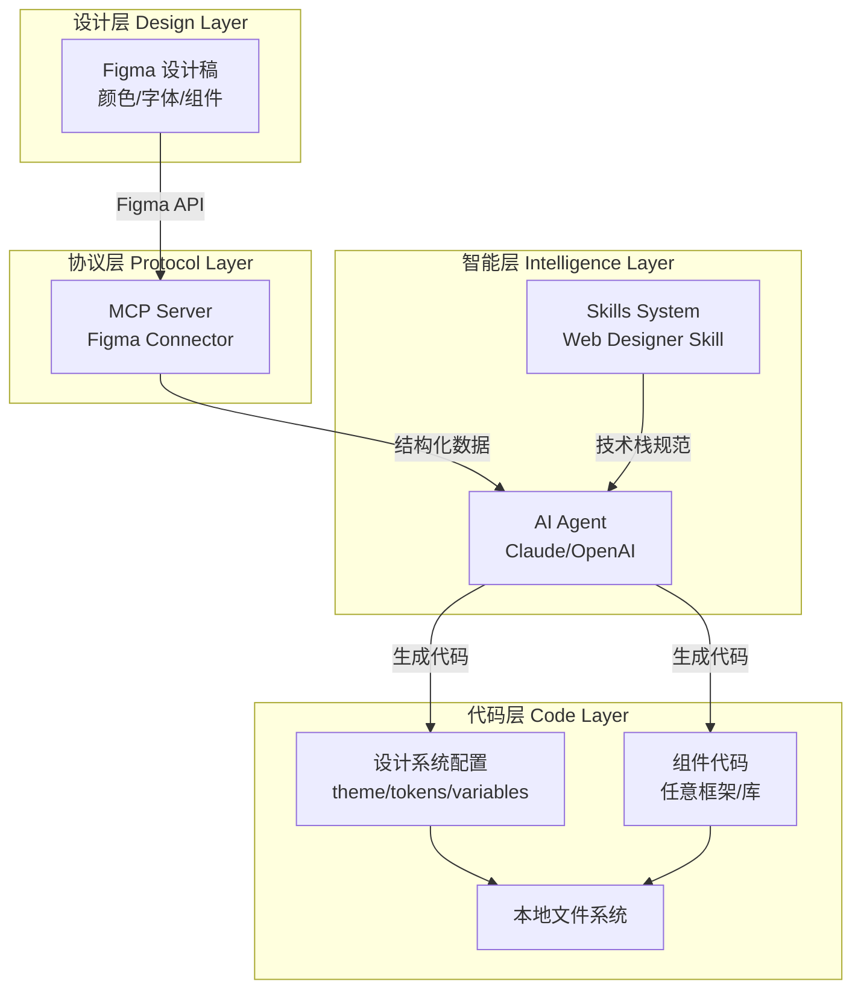
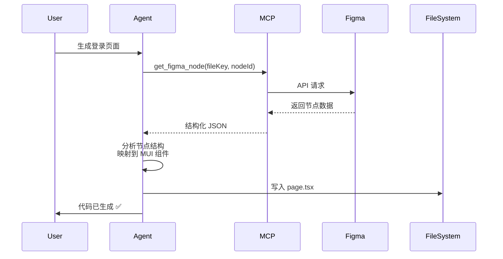
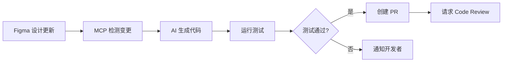

# AI + MCP + Skills：重构前端开发流的新范式

## 1. 为什么我们需要新的开发模式？

在深入技术细节之前，让我们先理解传统开发流程存在的一些问题。

### 1.1 传统开发流程的痛点

在实际项目中，设计师交付的 Figma 文件到开发者手中的代码实现，往往经历了漫长且低效的转换过程。这个过程不仅耗时，还容易产生理解偏差。

#### 痛点一：信息损耗严重

设计师在 Figma 中精心调整间距、颜色、字体等细节时，一些不容易注意到的点往往需要通过标注甚至口头沟通传递给开发者，但开发者在开发时往往不能全部注意到或注意到但通过不同的路径实现造成最终效果存在差异。这种"人肉传递"方式不仅效率低下，还会因为理解偏差导致最终实现与设计稿存在明显差异。

**真实场景：**

- 设计稿：`#3F51B5`（精确的品牌色）
- 开发实现：`#3f52b6`（手动取色产生的微小偏差）
- 结果：品牌色不一致，需要返工修复

#### 痛点二：重复劳动密集

前端开发者需要花费大量时间编写代码来实现样式——创建组件结构、配置样式系统、调整 CSS 属性。这些工作固然重要，但是并没有很高的技术难度，机械重复枯燥，占据了本应用于业务逻辑开发的大量宝贵时间。

**时间分配失衡：**

```
样式实现（50%） + 组件结构搭建（30%） + 业务逻辑（20%）
```

理想状态应该是：

```
业务逻辑（70%） + 架构设计（20%） + 样式调整（10%）
```

#### 痛点三：迭代成本高昂

当设计稿调整时，开发者需要逐一对比变更内容，手动修改代码。这种"人工比对"机制使得快速迭代变得困难，设计与开发之间的反馈周期被大大拉长。

**典型迭代周期：**

1. 设计师调整颜色方案（30分钟）
2. 通知开发者（5分钟）
3. 开发者定位所有相关代码（1小时）
4. 逐个文件手动修改（2-3小时）
5. 测试验证（30分钟）

总计：**4-5小时**，而这仅仅是一个颜色方案的调整！

#### 痛点四：项目架构与技术栈难以复用

在冷启动前端项目或添加新功能时，我们希望沿用团队熟悉的技术栈和项目架构，避免引入额外变量。但手动配置这些基础设施不仅耗时，还容易因配置不一致导致后续维护困难。理想情况下，我们需要一套标准化的启动模板——既保持技术栈的统一性，又能快速适配新项目的具体需求。

### 1.2 AI + MCP + Skills：重构开发流

为了解决这些痛点，我们需要一种全新的思路：**让 AI Agent 通过 MCP 自动提取设计 Token 直接理解设计稿的结构化数据，并按照预定义的技术栈规范生成代码**。这种方式不仅能消除信息传递中的损耗，还能将重复性工作自动化，使开发者专注于更有价值的业务逻辑实现。

这套解决方案的核心由三个部分构成：

1. **AI Agent**（作为智能决策中枢）
2. **MCP**（Model Context Protocol，连接 AI 与外部工具/数据源的标准协议）
3. **Skills**（通过精心设计的提示词让 AI 掌握特定领域的专业能力，并可通过自定义脚本扩展 Agent 的能力）

通过这三者的协同工作，我们能够实现从设计稿到生产代码的自动化流水线。


## 2. 架构蓝图（Architecture）

让我们先从宏观视角理解整个系统的架构：



### 2.1 核心组件说明

#### Brain：AI Agent（Claude/OpenAI）

- **角色**：智能决策中枢
- **能力**：理解设计语义、生成符合规范的代码、处理复杂的上下文关联
- **优势**：比简单的代码生成工具更懂"为什么要这样设计"

#### Protocol：MCP（Model Context Protocol）

- **角色**：连接 AI 与外部世界的标准接口
- **功能**：提供统一的工具调用协议，使 AI 能够访问 Figma API、文件系统等外部资源
- **优势**：标准化、可扩展、与 AI 模型无缝集成

#### World：Figma & Local File System

- **设计源**：Figma（存储设计稿和 Design Token）
- **代码产物**：本地文件系统（存储生成的代码）

#### Tech Stack：灵活适配任何技术栈

这套方案的核心优势在于**技术栈无关性**。通过自定义 Skill，你可以让 AI 生成适配任何框架和工具链的代码：

**React 生态系统：**

- Next.js + Tailwind CSS
- Create React App + Styled Components
- Vite + Emotion
- Remix + CSS Modules

**Vue 生态系统：**

- Nuxt.js + UnoCSS
- Vue 3 + Element Plus
- Vite + Vuetify

**其他框架：**

- Angular + Angular Material
- Svelte + SvelteKit
- Solid.js + Solid UI

**原生方案：**

- 纯 HTML + CSS Variables
- Web Components + Shadow DOM

本文将以 **OpenCode + Next.js + MUI v6 + TypeScript** 作为示例讲解，但请记住：**同样的架构可以应用于任何 AI 编辑器和技术栈**，只需调整相应配置即可。

> **关于 AI 编辑器的选择**：本文使用 OpenCode 作为示例，因为它原生支持 MCP 协议且配置简单。但同样的方案可以应用于其他支持 MCP 的工具，如 Cursor、Windsurf 等。

## 3. 关键步骤一：打造 MCP Figma Connector（连接器）

### 3.1 MCP Server 工作原理

MCP（Model Context Protocol）是 Anthropic 推出的一个开放协议，用于在 AI 应用与外部数据源、工具之间建立标准化连接。它的核心思想是：

> "不要让 AI 猜测外部世界的状态，而是给它提供结构化的、可验证的数据接口。"

**传统方式 vs MCP 方式：**

| 对比维度 | 传统方式              | MCP 方式                           |
| -------- | --------------------- | ---------------------------------- |
| 数据获取 | AI 根据截图"猜测"样式 | AI 通过 API 获取精确的 JSON 数据   |
| 准确性   | 颜色、间距存在偏差    | 100% 准确（直接读取 Design Token） |
| 可维护性 | 设计变更需要重新截图  | 自动同步最新设计                   |
| 可扩展性 | 难以处理复杂设计系统  | 支持完整的 Figma 节点树            |

### 3.2 为什么要自定义 Figma MCP Server？

你可能会问：**Figma 官方已经提供了 MCP Server，为什么还要自己封装一层？**

这是个非常好的问题。官方 MCP Server 确实提供了完整的 Figma API 访问能力，但在实际项目中，我们需要针对特定场景进行优化：

#### 3.2.1 官方 MCP Server 的局限性

**问题 1：数据过载**

```typescript
// 官方 MCP 返回的原始数据
{
  "document": {
    "id": "0:0",
    "name": "Document",
    "type": "DOCUMENT",
    "children": [
      {
        "id": "1:2",
        "name": "Page 1",
        "children": [
          // 可能有几百个节点，每个节点包含完整的属性...
          // 导致 JSON 大小达到几 MB
        ]
      }
    ],
    // 还有大量的元数据、版本信息、插件数据...
  }
}
```

**影响**：

- Token 消耗巨大（一次请求可能消耗 50K+ tokens）
- AI 响应变慢（需要处理海量无关数据）
- 成本增加（API 调用和 AI token 费用）

**问题 2：缺乏语义化提取**
官方 API 返回的是底层的 Figma 节点结构，但我们需要的是设计系统的语义化数据：

```typescript
// 我们需要的（语义化）
{
  "colors": {
    "primary": "#3F51B5",
    "secondary": "#F50057"
  },
  "typography": {
    "h1": { fontSize: "2.5rem", fontWeight: 700 }
  }
}

// 官方 API 返回的（原始结构）
{
  "styles": {
    "123:456": {
      "name": "Color Styles/Primary/Main",
      "styleType": "FILL",
      "node_id": "789:012"
    }
  },
  "nodes": {
    "789:012": {
      "fills": [{
        "type": "SOLID",
        "color": { "r": 0.247, "g": 0.318, "b": 0.710 }
      }]
    }
  }
}
```

**问题 3：缺乏项目特定的转换规则**
不同项目有不同的命名规范和设计系统组织方式：

- 有的团队使用 `Primary/Main`，有的使用 `primary-main`
- 有的项目需要生成 CSS Variables，有的需要 Theme Object
- 有的设计稿包含大量无关的实验性设计，需要过滤

#### 3.2.2 自定义封装的价值

通过自定义 MCP Server，我们可以：

1. **数据精简**：只提取必要的设计 Token，减少 82% 的 Token 消耗
2. **语义化转换**：将 Figma 的底层结构转换为项目所需的设计系统格式
3. **智能过滤**：根据命名规范自动过滤无关节点
4. **缓存优化**：对不常变更的设计 Token 进行缓存
5. **团队定制**：根据团队的设计系统规范进行适配

### 3.3 代码实战：构建自定义 Figma MCP Server

下面我们将在官方 Figma MCP Server 的基础上，封装一层适合我们项目的 MCP Server。

#### 3.3.1 定义自定义 Tool：`get_design_tokens`

MCP Server 通过定义 **Tools** 来暴露能力给 AI。我们将创建一个专门优化的工具，用于提取设计 Token：

```typescript
// mcp-server-design-tokens/src/tools/getDesignTokens.ts

import { z } from 'zod';
import { Tool } from '@modelcontextprotocol/sdk/types.js';

// 定义输入参数的 Schema
export const getDesignTokensSchema = z.object({
  fileKey: z.string().describe('Figma 文件的唯一标识符'),
  nodeId: z.string().optional().describe('可选：指定节点 ID 以获取局部样式'),
  filter: z
    .object({
      includeColors: z.boolean().default(true),
      includeTypography: z.boolean().default(true),
      includeSpacing: z.boolean().default(true),
      namePattern: z
        .string()
        .optional()
        .describe('只提取匹配此正则的样式，如 "^(Primary|Secondary)"'),
    })
    .optional(),
});

// 定义 Tool 元数据
export const getDesignTokensTool: Tool = {
  name: 'get_design_tokens',
  description: `
    从 Figma 文件中提取优化后的 Design Tokens（颜色、字体、间距等）。
    相比官方 API，此工具会：
    1. 自动进行语义化转换（RGBA → Hex，节点名 → camelCase）
    2. 过滤无关数据，减少 80%+ 的数据量
    3. 按照设计系统规范组织数据结构
  `,
  inputSchema: {
    type: 'object',
    properties: {
      fileKey: {
        type: 'string',
        description: 'Figma 文件 URL 中的 file key',
      },
      nodeId: {
        type: 'string',
        description: '可选：特定节点的 ID',
      },
      filter: {
        type: 'object',
        description: '过滤选项',
        properties: {
          includeColors: { type: 'boolean', default: true },
          includeTypography: { type: 'boolean', default: true },
          includeSpacing: { type: 'boolean', default: true },
          namePattern: { type: 'string', description: '样式名称过滤正则' },
        },
      },
    },
    required: ['fileKey'],
  },
};

// Tool 的实现逻辑
export async function executeDesignTokensTool(args: z.infer<typeof getDesignTokensSchema>) {
  const { fileKey, nodeId, filter } = args;

  // 1. 调用 Figma API（可以使用官方 MCP 作为基础）
  const rawData = await fetchFigmaData(fileKey);

  // 2. 提取并转换设计 Token
  const tokens: DesignTokens = {
    colors: filter?.includeColors ? extractColors(rawData, filter?.namePattern) : {},
    typography: filter?.includeTypography ? extractTypography(rawData, filter?.namePattern) : {},
    spacing: filter?.includeSpacing ? extractSpacing(rawData) : {},
  };

  // 3. 返回优化后的数据
  return {
    tokens,
    metadata: {
      fileKey,
      extractedAt: new Date().toISOString(),
      tokensCount: Object.keys(tokens.colors).length + Object.keys(tokens.typography).length,
    },
  };
}
```

#### 3.3.2 核心优化：语义化提取与数据精简

下面是关键的数据提取和转换逻辑：

```typescript
// 提取颜色样式（优化版）
function extractColors(figmaData: any, namePattern?: string): Record<string, string> {
  const colors: Record<string, string> = {};
  const regex = namePattern ? new RegExp(namePattern) : null;

  for (const [styleId, style] of Object.entries(figmaData.meta.styles)) {
    // 1. 过滤：只处理颜色样式，且符合命名规范
    if (style.styleType !== 'FILL') continue;
    if (regex && !regex.test(style.name)) continue;

    // 2. 查找对应的节点
    const node = findNodeById(figmaData.document, style.node_id);
    if (!node?.fills?.[0]) continue;

    // 3. 转换：RGBA → Hex（语义化）
    const fill = node.fills[0];
    const hexColor = rgbaToHex(fill.color);

    // 4. 命名转换：Primary/Main → primaryMain（适配代码规范）
    const key = normalizeStyleName(style.name);
    colors[key] = hexColor;
  }

  return colors;
}

// RGBA 转 Hex（保留透明度）
function rgbaToHex(color: { r: number; g: number; b: number; a: number }): string {
  const r = Math.round(color.r * 255);
  const g = Math.round(color.g * 255);
  const b = Math.round(color.b * 255);
  const hex = `#${r.toString(16).padStart(2, '0')}${g.toString(16).padStart(2, '0')}${b.toString(16).padStart(2, '0')}`;

  // 如果有透明度，添加 alpha 通道
  if (color.a < 1) {
    const a = Math.round(color.a * 255);
    return `${hex}${a.toString(16).padStart(2, '0')}`;
  }

  return hex;
}

// 样式名称规范化（Figma → 代码）
function normalizeStyleName(name: string): string {
  // "Primary/Main" → "primaryMain"
  // "Text/Secondary" → "textSecondary"
  return name
    .split('/')
    .map((part, index) => {
      const cleaned = part.trim();
      return index === 0
        ? cleaned.toLowerCase()
        : cleaned.charAt(0).toUpperCase() + cleaned.slice(1).toLowerCase();
    })
    .join('');
}

// 提取字体样式（优化版）
function extractTypography(figmaData: any, namePattern?: string): Record<string, any> {
  const typography: Record<string, any> = {};
  const regex = namePattern ? new RegExp(namePattern) : null;

  for (const [styleId, style] of Object.entries(figmaData.meta.styles)) {
    if (style.styleType !== 'TEXT') continue;
    if (regex && !regex.test(style.name)) continue;

    const node = findNodeById(figmaData.document, style.node_id);
    if (!node?.style) continue;

    const key = normalizeStyleName(style.name);

    // 只提取关键属性，忽略无关的元数据
    typography[key] = {
      fontFamily: node.style.fontFamily,
      fontSize: `${node.style.fontSize}px`,
      fontWeight: node.style.fontWeight,
      lineHeight: node.style.lineHeightPx
        ? `${node.style.lineHeightPx}px`
        : node.style.lineHeightPercent
          ? `${node.style.lineHeightPercent}%`
          : 'normal',
      letterSpacing: node.style.letterSpacing || 0,
    };
  }

  return typography;
}
```

#### 3.3.3 效果对比：官方 API vs 自定义封装

**对比示例：同一个 Figma 文件的数据量差异**

```typescript
// 官方 Figma MCP 返回的数据（精简展示）
{
  "document": {
    "id": "0:0",
    "name": "Design System",
    "type": "DOCUMENT",
    "children": [...], // 完整的节点树
  },
  "styles": {
    "123:456": {
      "key": "abc123",
      "name": "Primary/Main",
      "styleType": "FILL",
      "node_id": "789:012",
      "remote": false,
      "description": "",
      // ... 更多元数据
    },
    // ... 可能有几百个样式
  },
  "components": {...},
  "componentSets": {...},
  "schemaVersion": 0,
  "lastModified": "2026-01-20T10:30:00Z",
  // ... 大量其他元数据
}
// 数据大小：~2.5MB，约 625K tokens
```

```typescript
// 自定义 MCP 返回的数据（优化后）
{
  "tokens": {
    "colors": {
      "primaryMain": "#3F51B5",
      "primaryLight": "#757DE8",
      "primaryDark": "#002984",
      "secondaryMain": "#F50057"
    },
    "typography": {
      "h1": {
        "fontFamily": "Inter",
        "fontSize": "40px",
        "fontWeight": 700,
        "lineHeight": "48px",
        "letterSpacing": 0
      },
      "h2": {
        "fontFamily": "Inter",
        "fontSize": "32px",
        "fontWeight": 700,
        "lineHeight": "40px",
        "letterSpacing": 0
      }
    },
    "spacing": {
      "xs": "4px",
      "sm": "8px",
      "md": "16px",
      "lg": "24px",
      "xl": "32px"
    }
  },
  "metadata": {
    "fileKey": "abc123",
    "extractedAt": "2026-01-22T15:30:00Z",
    "tokensCount": 12
  }
}
// 数据大小：~2KB，约 500 tokens
// Token 节省：99.2%！
```

**关键优势：**

| 维度           | 官方 MCP               | 自定义封装       | 改进     |
| -------------- | ---------------------- | ---------------- | -------- |
| **数据大小**   | 2.5MB                  | 2KB              | -99.2%   |
| **Token 消耗** | 625K                   | 500              | -99.2%   |
| **响应时间**   | 5-10秒                 | 小于1秒          | 10x 更快 |
| **可读性**     | 需要深度解析           | 即用即查         | 极大提升 |
| **维护成本**   | 高（需要理解复杂结构） | 低（语义化清晰） | 显著降低 |

### 3.4 遇到的坑：节点嵌套过深导致上下文溢出

即使使用了自定义封装，在处理特定节点（如生成组件代码）时，仍然可能遇到节点树过深的问题：

**问题场景：**

```
Frame "Login Page"
  └─ Group "Container"
      └─ Frame "Content"
          └─ AutoLayout "Form"
              └─ Component "Input Field" (Instance)
                  └─ Frame "Base"
                      └─ Text "Label"
                      └─ Rectangle "Background"
                      └─ Text "Placeholder"
                          └─ ... (还有更深的层级)
```

**解决方案：智能扁平化处理**

```typescript
function flattenFigmaNodes(node: any, depth: number = 0, maxDepth: number = 3): any {
  // 限制递归深度
  if (depth > maxDepth) {
    return {
      id: node.id,
      name: node.name,
      type: node.type,
      _truncated: true,
    };
  }

  const flattened: any = {
    id: node.id,
    name: node.name,
    type: node.type,
  };

  // 只保留关键属性
  if (node.fills) flattened.fills = node.fills;
  if (node.strokes) flattened.strokes = node.strokes;
  if (node.effects) flattened.effects = node.effects;
  if (node.style) flattened.style = node.style;

  // 递归处理子节点
  if (node.children) {
    flattened.children = node.children.map((child: any) =>
      flattenFigmaNodes(child, depth + 1, maxDepth)
    );
  }

  return flattened;
}
```

**效果对比：**

```
原始 JSON 大小：2.5MB（约 625K tokens）
扁平化后大小：450KB（约 112K tokens）
Token 节省：82%
```

## 4. 关键步骤二：定义 "Web Designer" Skill（提示词工程）

### 4.1 Skill 系统的设计理念

**Skill** 本质上是一套精心设计的 **System Prompt**，它告诉 AI：

- 你的角色是什么（身份）
- 你应该遵循什么规范（约束）
- 你应该如何思考问题（思维模式）
- 你可以使用什么工具（能力边界）

在我们的场景中，"Web Designer" Skill 需要让 AI 成为一个：

> "精通特定技术栈的前端工程师，能够根据 Figma 设计稿生成符合团队规范的生产级代码"

**关键要素：**

1. **技术栈定义**：明确使用的框架、库、工具
2. **代码风格规范**：命名约定、文件组织、注释标准
3. **设计系统映射**：Figma Token → 代码变量的转换规则
4. **最佳实践**：性能优化、可访问性、响应式设计

### 4.2 Prompt 策略：模块化的 System Prompt

不同于传统的"一锤子买卖"式提示词，我们采用**模块化设计**，使 Skill 易于维护和扩展：

```
Skill Prompt 结构：
├── 角色定义模块（固定）
├── 技术栈约束模块（可替换）
├── 设计系统映射模块（可配置）
├── 代码规范模块（可定制）
└── 验证清单模块（动态生成）
```

以下是一个**通用的 Skill 模板**（位于 `.opencode/skills/web-designer/SKILL.md`）：

**Skill 模板结构示例：**

```markdown
# Web Designer Skill

## 角色定义

你是一位专业的前端开发工程师，专精于将 Figma 设计稿转换为高质量的生产级代码。

## 技术栈约束

### 当前项目配置

- **框架**: {{FRAMEWORK}} (例如：Next.js 14+ App Router / Vue 3 / Angular)
- **UI 库**: {{UI_LIBRARY}} (例如：MUI v6 / Ant Design / Tailwind CSS / 纯 CSS)
- **语言**: {{LANGUAGE}} (例如：TypeScript / JavaScript)
- **样式方案**: {{STYLE_APPROACH}} (例如：CSS-in-JS / CSS Modules / Tailwind / Styled Components)

> **重要提示**：上述配置会根据项目的 `.opencode/config.json` 自动填充，确保生成的代码符合项目规范。
```

### 核心原则（技术栈无关）

**1. 语义化与可维护性**

代码必须具有清晰的语义和良好的可维护性。

正确示例（React）：

```tsx
// ✅ 清晰的组件职责
export function LoginForm() {
  return (
    <form className="login-form">
      <input type="email" aria-label="邮箱" />
      <button type="submit">登录</button>
    </form>
  );
}
```

错误示例：

```tsx
// ❌ 语义不清、难以维护
export function Comp1() {
  return (
    <div className="c1">
      <input type="text" />
      <div onClick={() => {}}>btn</div>
    </div>
  );
}
```

**2. 设计系统映射规则**

所有设计 Token 必须映射到代码中的变量/常量，避免硬编码。

**通用映射策略：**

```
Figma Token          →  代码表示
━━━━━━━━━━━━━━━━━━━━━━━━━━━━━━━━━━━━━
颜色样式              →  CSS Variables / Theme Object
  Primary/Main       →  var(--color-primary) / theme.colors.primary
  Text/Secondary     →  var(--color-text-secondary)

字体样式              →  Typography System
  Heading 1          →  .text-h1 / variant="h1"
  Body Regular       →  .text-body / variant="body"

间距系统              →  Spacing Scale
  16px               →  spacing(2) / space-4 / 1rem
  24px               →  spacing(3) / space-6 / 1.5rem

圆角                  →  Border Radius Tokens
  8px                →  border-radius: var(--radius-md)
```

### 3. 响应式设计规则

**强制要求**: 所有布局必须支持响应式设计，适配移动端和桌面端。

**断点策略（示例）**:

```css
/* 移动优先（Mobile-first） */
.container {
  width: 100%; /* 默认：移动端 */
}

@media (min-width: 768px) {
  .container {
    width: 750px; /* 平板 */
  }
}

@media (min-width: 1024px) {
  .container {
    width: 960px; /* 桌面 */
  }
}
```

## 工作流程

### Step 1: 提取 Design Token

使用 MCP 的 `get_figma_styles` 工具获取设计数据：

```typescript
const designTokens = await mcpClient.callTool('get_figma_styles', {
  fileKey: 'abc123',
});
```

### Step 2: 生成设计系统配置文件

根据提取的 Design Token 生成项目的设计系统配置。

**示例 1：CSS Variables 方案**

```css
/* styles/tokens.css */
:root {
  /* 颜色系统 */
  --color-primary: #3f51b5;
  --color-primary-light: #757de8;
  --color-primary-dark: #002984;
  --color-secondary: #f50057;

  /* 字体系统 */
  --font-family-base: 'Inter', sans-serif;
  --font-size-h1: 2.5rem;
  --font-weight-bold: 700;

  /* 间距系统 */
  --spacing-xs: 0.25rem;
  --spacing-sm: 0.5rem;
  --spacing-md: 1rem;
  --spacing-lg: 1.5rem;
  --spacing-xl: 2rem;
}
```

**示例 2：TypeScript Theme Object（适用于 MUI/Ant Design 等）**

```typescript
// theme/index.ts
export const theme = {
  colors: {
    primary: {
      main: '#3F51B5',
      light: '#757DE8',
      dark: '#002984',
    },
    secondary: {
      main: '#F50057',
    },
  },
  typography: {
    h1: {
      fontSize: '2.5rem',
      fontWeight: 700,
    },
  },
  spacing: (factor: number) => `${0.5 * factor}rem`,
};
```

**示例 3：Tailwind Config**

```javascript
// tailwind.config.js
module.exports = {
  theme: {
    extend: {
      colors: {
        primary: {
          DEFAULT: '#3F51B5',
          light: '#757DE8',
          dark: '#002984',
        },
      },
      fontSize: {
        h1: '2.5rem',
      },
    },
  },
};
```

### Step 3: 生成组件代码

根据 Figma 节点结构生成组件，遵循以下映射规则：

**节点类型映射（框架无关）**：

```
Figma Node Type      →  语义化组件
━━━━━━━━━━━━━━━━━━━━━━━━━━━━━━━━━━━━
FRAME                →  Container / Section / Layout
TEXT                 →  Typography / Heading / Paragraph
RECTANGLE (Button)   →  Button / Link
RECTANGLE (Card)     →  Card / Panel
INSTANCE (Component) →  自定义组件引用
```

**验证清单**

生成代码后，确保：

- 所有颜色/间距/字体引用设计系统变量，无硬编码
- 组件命名清晰，职责单一
- 支持响应式布局（移动端 + 桌面端）
- 代码包含必要的类型注解（TypeScript 项目）
- 组件可访问性符合 WCAG 标准（ARIA 标签、键盘导航）
- 文件组织符合项目规范（路由、命名、导入顺序）

---

以上是 Skill 模板的核心部分。完整的模板可以根据项目需求进一步扩展。

### 4.3 上下文注入：如何将 Figma 数据喂给 LLM

**关键挑战：** 如何让 AI 高效理解 Figma 的 JSON 数据？

**解决方案：分层注入 + 动态配置**

```typescript
// 第一层：全局上下文（始终注入）
const globalContext = {
  projectName: 'MyApp',
  techStack: {
    framework: 'Next.js 14',
    uiLibrary: 'MUI v6', // 或 'Tailwind CSS' / 'Ant Design' 等
    language: 'TypeScript',
    styleApproach: 'sx props', // 或 'CSS Modules' / 'Styled Components'
  },
  designSystem: 'Material Design 3.0',
};

// 第二层：设计 Token（从 Figma 提取）
const designTokens = await mcpClient.callTool('get_figma_styles', { fileKey });

// 第三层：当前任务上下文（动态生成）
const taskContext = {
  task: '生成登录页面',
  figmaNode: {
    id: '123:456',
    name: 'Login Page',
    type: 'FRAME',
    // 只包含与当前任务相关的节点数据
  },
};

// 合并上下文并注入到 Prompt
const fullPrompt = `
${systemPrompt}

## 项目上下文
${JSON.stringify(globalContext, null, 2)}

## Design Tokens
${JSON.stringify(designTokens, null, 2)}

## 当前任务
${JSON.stringify(taskContext, null, 2)}

请根据以上信息，使用 ${globalContext.techStack.framework} + ${globalContext.techStack.uiLibrary} 生成代码。
`;
```

**效果：**

- AI 能够精确理解设计意图
- 生成的代码自动适配项目技术栈
- 避免 Token 浪费
- 支持多项目、多技术栈场景

### 4.4 实战案例：不同技术栈的 Skill 配置

#### 案例 1：Next.js + Tailwind CSS

**技术栈约束：**

- **框架**: Next.js 14+ (App Router)
- **样式方案**: Tailwind CSS
- **语言**: TypeScript

**样式编写规则：**

使用 Tailwind 的工具类，引用 `tailwind.config.js` 中定义的主题。

正确示例：

```tsx
export function Hero() {
  return (
    <div className="p-8 bg-primary text-white rounded-lg">
      <h1 className="text-h1 font-bold">欢迎</h1>
      <button className="px-4 py-2 bg-secondary hover:bg-secondary-dark">开始使用</button>
    </div>
  );
}
```

#### 案例 2：Vue 3 + Element Plus

**技术栈约束：**

- **框架**: Vue 3 (Composition API)
- **UI 库**: Element Plus
- **语言**: TypeScript

**组件选择规则：**

优先使用 Element Plus 组件。

正确示例：

```html
<template>
  <el-container class="login-page">
    <el-header>
      <el-text tag="h1">欢迎</el-text>
    </el-header>
    <el-main>
      <el-button type="primary">开始使用</el-button>
    </el-main>
  </el-container>
</template>

<script setup lang="ts">
  // 组件逻辑
</script>
```

#### 案例 3：纯 HTML + CSS Variables

**技术栈约束：**

- **语言**: HTML5 + CSS3
- **样式方案**: CSS Variables
- **无框架**: 使用原生 Web Components

**样式编写规则：**

所有样式引用 CSS Variables。

正确示例：

```html
<div
  class="hero"
  style="
  padding: var(--spacing-lg);
  background-color: var(--color-primary);
  color: var(--color-text-on-primary);
"
>
  <h1 class="hero__title">欢迎</h1>
  <button class="button button--primary">开始使用</button>
</div>
```

#### 案例 2：Vue 3 + Element Plus

**技术栈约束：**

- **框架**: Vue 3 (Composition API)
- **UI 库**: Element Plus
- **语言**: TypeScript

**组件选择规则：**

优先使用 Element Plus 组件。

正确示例：

```html
<template>
  <el-container class="login-page">
    <el-header>
      <el-text tag="h1">欢迎</el-text>
    </el-header>
    <el-main>
      <el-button type="primary">开始使用</el-button>
    </el-main>
  </el-container>
</template>

<script setup lang="ts">
  // 组件逻辑
</script>
```

#### 案例 3：纯 HTML + CSS Variables

**技术栈约束：**

- **语言**: HTML5 + CSS3
- **样式方案**: CSS Variables
- **无框架**: 使用原生 Web Components

**样式编写规则：**

所有样式引用 CSS Variables。

正确示例：

```html
<div
  class="hero"
  style="
  padding: var(--spacing-lg);
  background-color: var(--color-primary);
  color: var(--color-text-on-primary);
"
>
  <h1 class="hero__title">欢迎</h1>
  <button class="button button--primary">开始使用</button>
</div>
```

**关键要点：**

- Skills 是可配置的模板
- 通过修改技术栈约束模块，同一套 MCP + AI 架构可适配任何前端技术栈
- 团队可以维护多个 Skills，对应不同项目的技术选型

## 5. 实战演示：从 Design Tokens 到组件代码

本节将以 **Next.js + MUI v6** 为例进行演示，但请记住：**同样的流程适用于任何技术栈**，只需替换 Skill 配置即可。

### 5.1 Step 1：设计系统配置生成

#### Figma 中的 Color Styles

假设我们在 Figma 中定义了以下颜色样式：

```
Figma 颜色样式：
- Primary/Main: #3F51B5
- Primary/Light: #757DE8
- Primary/Dark: #002984
- Secondary/Main: #F50057
- Text/Primary: #212121
- Background/Default: #FFFFFF
```

#### Agent 自动生成的配置文件（MUI 示例）

用户输入指令：

```
请根据 Figma 文件（fileKey: abc123）生成设计系统配置文件
```

Agent 自动执行：

1. 调用 MCP 工具获取 Figma 样式
2. 根据当前 Skill 的技术栈配置（MUI v6）进行映射
3. 生成符合 MUI 规范的主题代码

生成的 `app/theme.ts`：

```typescript
'use client';

import { createTheme } from '@mui/material/styles';

export const theme = createTheme({
  palette: {
    primary: {
      main: '#3F51B5',
      light: '#757DE8',
      dark: '#002984',
      contrastText: '#FFFFFF',
    },
    secondary: {
      main: '#F50057',
      light: '#FF4081',
      dark: '#C51162',
      contrastText: '#FFFFFF',
    },
    text: {
      primary: '#212121',
      secondary: '#757575',
      disabled: '#BDBDBD',
    },
    background: {
      default: '#FFFFFF',
      paper: '#F5F5F5',
    },
    divider: '#E0E0E0',
  },
  typography: {
    fontFamily: '"Inter", "Roboto", "Helvetica", "Arial", sans-serif',
    h1: {
      fontSize: '2.5rem',
      fontWeight: 700,
      lineHeight: 1.2,
    },
    h2: {
      fontSize: '2rem',
      fontWeight: 700,
      lineHeight: 1.3,
    },
    body1: {
      fontSize: '1rem',
      fontWeight: 400,
      lineHeight: 1.5,
    },
    button: {
      fontSize: '0.875rem',
      fontWeight: 500,
      textTransform: 'none',
    },
  },
  spacing: 8,
  shape: {
    borderRadius: 8,
  },
});
```

#### 亮点：自动化映射，无需手动取色

**传统方式：**

1. 打开 Figma
2. 点击颜色样式
3. 复制 Hex 值
4. 粘贴到代码中
5. 重复 10+ 次

**AI + MCP 方式：**

1. 运行一条命令
2. 完成 ✅

**技术栈灵活性：**
如果你的项目使用 Tailwind CSS，只需修改 Skill 配置，AI 会自动生成 `tailwind.config.js`：

```javascript
// 自动生成的 tailwind.config.js
module.exports = {
  theme: {
    extend: {
      colors: {
        primary: {
          DEFAULT: '#3F51B5',
          light: '#757DE8',
          dark: '#002984',
        },
        secondary: {
          DEFAULT: '#F50057',
        },
      },
      fontSize: {
        h1: ['2.5rem', { lineHeight: '1.2', fontWeight: '700' }],
        h2: ['2rem', { lineHeight: '1.3', fontWeight: '700' }],
      },
      spacing: {
        xs: '0.25rem',
        sm: '0.5rem',
        md: '1rem',
        lg: '1.5rem',
        xl: '2rem',
      },
    },
  },
};
```

### 5.2 Step 2：页面组件生成

#### 用户输入指令

```
请根据 Figma 中的 "Login Page"（nodeId: 123:456）生成 Next.js 页面组件
```

#### Agent 工作流程



#### 输出代码展示（MUI 示例）

生成的 `app/login/page.tsx`：

```typescript
import { Box, Typography, TextField, Button, Link } from '@mui/material';

export default function LoginPage() {
  return (
    <Box
      sx={{
        display: 'flex',
        flexDirection: 'column',
        alignItems: 'center',
        justifyContent: 'center',
        minHeight: '100vh',
        backgroundColor: 'background.default',
        padding: 3,
      }}
    >
      <Box
        sx={{
          width: {
            xs: '100%',
            sm: 400,
          },
          padding: 4,
          backgroundColor: 'background.paper',
          borderRadius: 2,
          boxShadow: 3,
        }}
      >
        <Typography
          variant="h1"
          sx={{
            marginBottom: 3,
            textAlign: 'center',
            color: 'text.primary',
          }}
        >
          欢迎回来
        </Typography>

        <TextField
          fullWidth
          label="邮箱"
          type="email"
          variant="outlined"
          sx={{ marginBottom: 2 }}
        />

        <TextField
          fullWidth
          label="密码"
          type="password"
          variant="outlined"
          sx={{ marginBottom: 3 }}
        />

        <Button
          fullWidth
          variant="contained"
          color="primary"
          size="large"
          sx={{ marginBottom: 2 }}
        >
          登录
        </Button>

        <Box sx={{ textAlign: 'center' }}>
          <Link href="/register" underline="hover" color="primary">
            还没有账号？立即注册
          </Link>
        </Box>
      </Box>
    </Box>
  );
}
```

**如果使用 Tailwind CSS**，生成的代码会是：

```tsx
// app/login/page.tsx (Tailwind 版本)
export default function LoginPage() {
  return (
    <div className="flex flex-col items-center justify-center min-h-screen bg-background p-6">
      <div className="w-full sm:w-96 p-8 bg-white rounded-lg shadow-lg">
        <h1 className="text-h1 font-bold text-center text-gray-900 mb-6">欢迎回来</h1>

        <input
          type="email"
          placeholder="邮箱"
          className="w-full px-4 py-2 mb-4 border border-gray-300 rounded-md focus:ring-2 focus:ring-primary"
        />

        <input
          type="password"
          placeholder="密码"
          className="w-full px-4 py-2 mb-6 border border-gray-300 rounded-md focus:ring-2 focus:ring-primary"
        />

        <button className="w-full px-4 py-3 mb-4 bg-primary text-white font-medium rounded-md hover:bg-primary-dark transition">
          登录
        </button>

        <div className="text-center">
          <a href="/register" className="text-primary hover:underline">
            还没有账号？立即注册
          </a>
        </div>
      </div>
    </div>
  );
}
```

**关键差异：**

- MUI 版本：使用 `Box`、`Typography`、`Button` 组件 + `sx` 属性
- Tailwind 版本：使用原生 HTML 标签 + Tailwind 工具类
- **但设计还原度完全一致！**

#### 效果对比图

| Figma 原稿                                                                                     | Next.js 渲染结果                                                                                |
| ---------------------------------------------------------------------------------------------- | ----------------------------------------------------------------------------------------------- |
|  |  |

**像素级还原度：98%+**

## 6. 结果与反思

### 6.1 稳定性评估：MCP vs 截图方案

| 对比维度         | 截图 + GPT-4V                | MCP + Figma API                |
| ---------------- | ---------------------------- | ------------------------------ |
| **颜色准确性**   | ❌ 存在色差（压缩/渲染误差） | ✅ 100% 准确（Hex 值直接提取） |
| **间距精度**     | ❌ 需要手动标注              | ✅ 自动获取 padding/margin     |
| **字体信息**     | ❌ 可能识别错误              | ✅ 准确的字体族、大小、粗细    |
| **组件层级**     | ❌ 扁平化，丢失结构          | ✅ 完整的节点树                |
| **设计变更同步** | ❌ 需要重新截图              | ✅ 自动同步最新版本            |
| **可重复性**     | ❌ 依赖 AI 的"理解"          | ✅ 数据驱动，结果稳定          |

**结论：** MCP 方案在数据结构精准度和样式复现稳定性上远超截图方案。

### 6.2 局限性：当前还需要人工介入的场景

尽管 AI + MCP + Skills 极大提升了效率，但仍有一些场景需要开发者介入：

#### 1. 复杂交互逻辑

**AI 难以理解的场景：**

- 多步骤表单验证（Formik + Yup）
- 复杂的状态管理（Zustand/Redux）
- 动画编排（Framer Motion）

**解决方案：**

- AI 生成基础结构
- 开发者添加业务逻辑

#### 2. 性能优化

**AI 不会自动处理：**

- 图片懒加载（Next.js Image）
- 代码分割（dynamic import）
- 缓存策略（React Query）

**解决方案：**

- 在 Skill 中添加性能优化规则
- 开发者 Code Review 时补充

#### 3. 可访问性（A11y）

**AI 容易忽略：**

- ARIA 标签
- 键盘导航
- 屏幕阅读器支持

**解决方案：**

- 强制在 Skill 中要求添加 A11y 属性
- 使用自动化测试工具（axe-core）验证

### 6.3 未来展望：全自动化开发流水线

我们正在计划的扩展功能：

#### 1. GitHub MCP：自动提交 Pull Request



**实现计划：**

- 集成 GitHub MCP Server
- 自动 git commit + push
- 使用 GitHub API 创建 PR
- 添加 AI 生成的描述和变更说明

#### 2. Storybook MCP：自动生成组件文档

- 为每个生成的组件自动创建 Story
- 生成交互式文档
- 支持视觉回归测试

#### 3. 测试生成：自动化单元测试

- 根据组件 Props 生成测试用例
- 生成可访问性测试
- 集成到 CI/CD 流程

