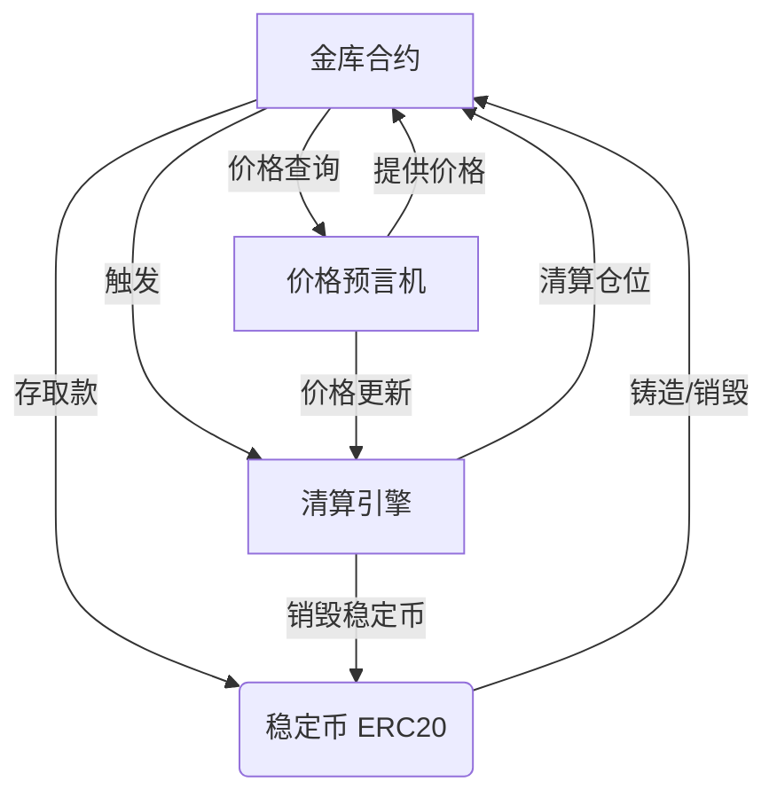
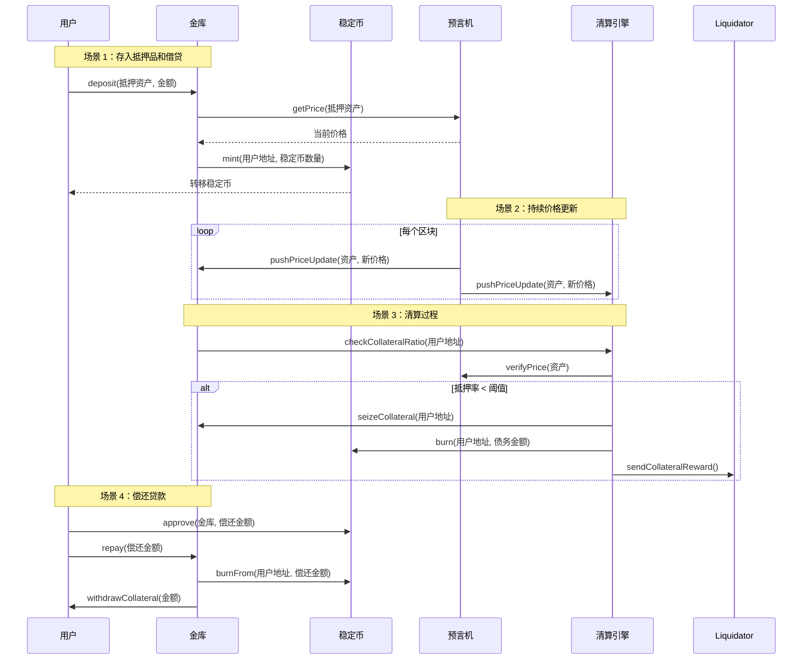

# 如何实现简单的抵押稳定币协议

## 1. 介绍

抵押稳定币是 DeFi 的基础构建块，通过超额抵押提供价格稳定性。本文将指导你在以太坊上创建一个简单而健壮的抵押稳定币协议。

## 2. 什么是抵押稳定币？为什么它是稳定的？

抵押稳定币是由特定资产抵押的一种稳定币。最常见的抵押资产包括 USDC、USDT、ETH 等。
稳定币的价格与抵押资产的价格挂钩，从而使稳定币保持稳定。为了使其稳定，我们应该设计一个激励机制，使保持价格稳定最有利可图。

例如，如果我们想让稳定币价格稳定在 1 美元，我们应该让稳定币的可借贷金额小于抵押品的总美元价值。如果稳定币的价格过高，而你想要偿还债务以提取抵押品，你不会这样做，因为你需要支付稳定币的溢价来偿还债务，这是不划算的，由于这种需求很少，所以稳定币的价格不太可能高于 1 美元。

相反，当价格跌破锚定价格时，清算机制就会发挥作用。
如果用户的抵押品价值由于价格波动而跌破预设阈值，
他们的抵押品将能够被清算机制清算。
为了进一步增强稳定性维持机制的有效性，
我们将对那些缺乏抵押品并导致价格下跌的人增加惩罚，
主动清算债务的个人可以获得部分惩罚的奖励
。这不仅鼓励债务人及时采取行动以避免更严重的后果
，还能将维持市场稳定性的负担更公平地分配给参与者。

## 2. 先决条件

### 开发环境设置

- Node.js 和 npm 安装，用于安装 truffle 和开发 dapp
- Solidity 编译器设置，以便你可以编译 solidity 代码
- 安装 Truffle 开发框架，可以降低开发和部署智能合约的难度，还提供用于测试的本地网络
- MetaMask 钱包配置，用于部署合约和与合约交互
- Sepolia，以太坊官方测试网，用于测试

## 3. 核心协议设计

### 设计协议时我们应该考虑什么？

在开始实现协议之前，我们需要设计协议的架构，
我们的目标是使其更加健壮、可扩展和安全，同时也易于理解和维护，
显然，还要处理抵押品的价格波动，使稳定币保持稳定的价格。

为了解决这些问题，我们需要设计协议的架构，首先，
我们需要选择我们的稳定币使用哪种协议，这里我选择 ERC20 作为稳定币的协议，因为它是最常见的协议，具有成熟的工具和库。
至于使用哪种币作为抵押品，常见的抵押品有 USDC、USDT、ETH、NFT 等，由于我们想要使其简单且在以太坊网络上，所以我选择 ETH 作为抵押品。
因此我们需要一个金库合约来管理抵押品，我们需要获取抵押品的价格，所以我们还需要一个预言机合约，对于价格反馈，
我选择 ChainLink，因为它被广泛使用且相对可靠。
最重要的部分，应该有一个清算机制，可以在价格变化时处理债务并维持代币价格稳定。

协议的核心组件如下：

- ERC20 代币合约
- 金库合约（抵押品管理）
- 价格预言机集成
- 清算机制

在我们有一个大致的架构后，我们应该深入了解协议的细节。
金库至少应该向外部暴露 5 个方法：

- deposit（存款）
- withdraw（提款）
- borrow（借贷）
- repay（偿还）
- liquidate（清算）

代币合约至少应该提供 mint 和 burn，预言机合约至少应该提供一个获取价格变化的方法。

根据以上内容，我们可以得到以下显示协议架构的图表：

以下图表显示了抵押化过程：

更详细的信息，我将在以下部分结合协议的实现细节进行介绍。

## 结论

在本文中，我们构建了一个简单而实用的抵押稳定币协议。该协议包括：

- 具有铸造和销毁功能的稳定币代币（ZetaCoin）
- 用于管理抵押品和债务头寸的金库合约
- 与 Chainlink 的价格预言机集成
- 维持协议偿付能力的清算机制

虽然此实现很基础，但它演示了抵押稳定币的核心概念。在生产环境中，你会想要添加：

- 更复杂的风险参数
- 额外的抵押品类型
- 治理机制
- 紧急暂停功能
- 全面的测试和审计
- 坏债保险机制

请记住，DeFi 协议在部署到主网之前需要进行广泛的测试和审计。始终从测试网开始，逐步增加测试范围。